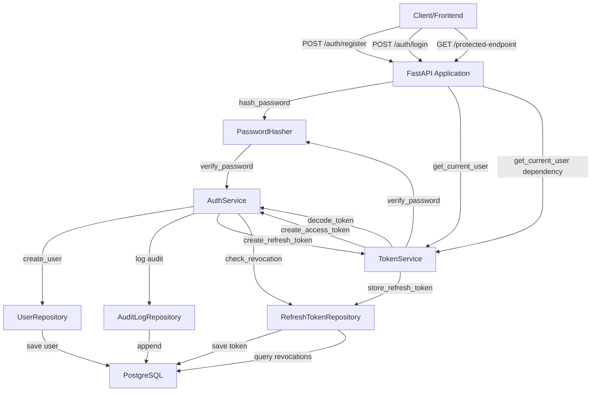
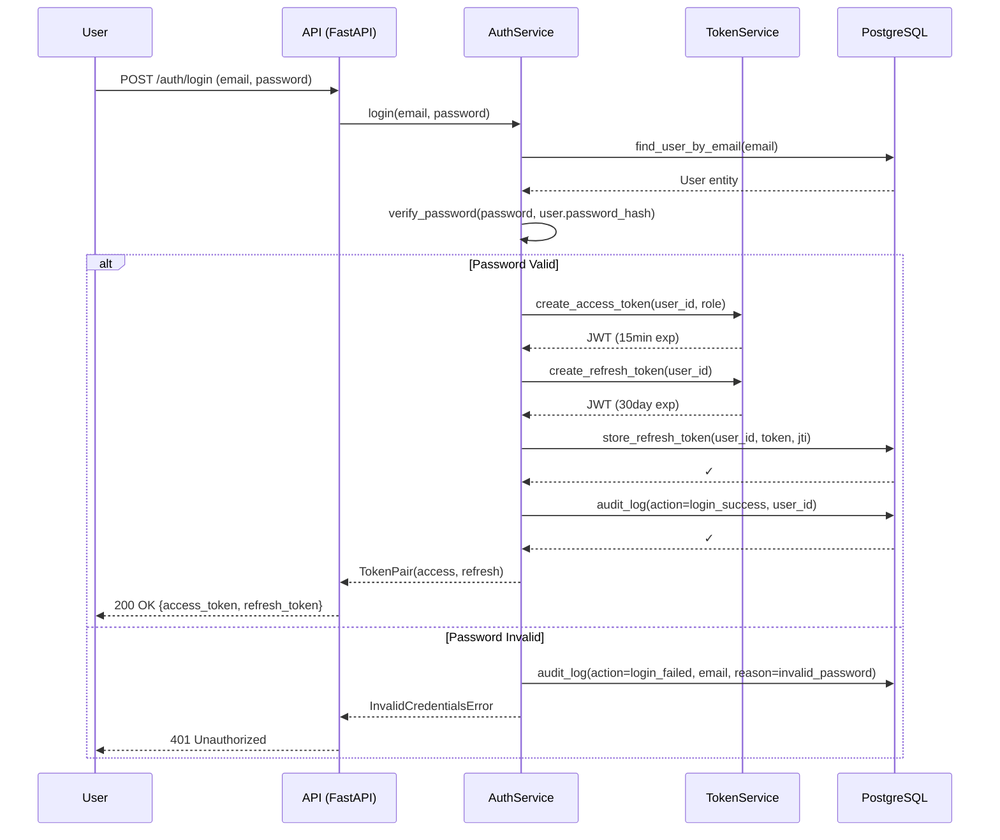
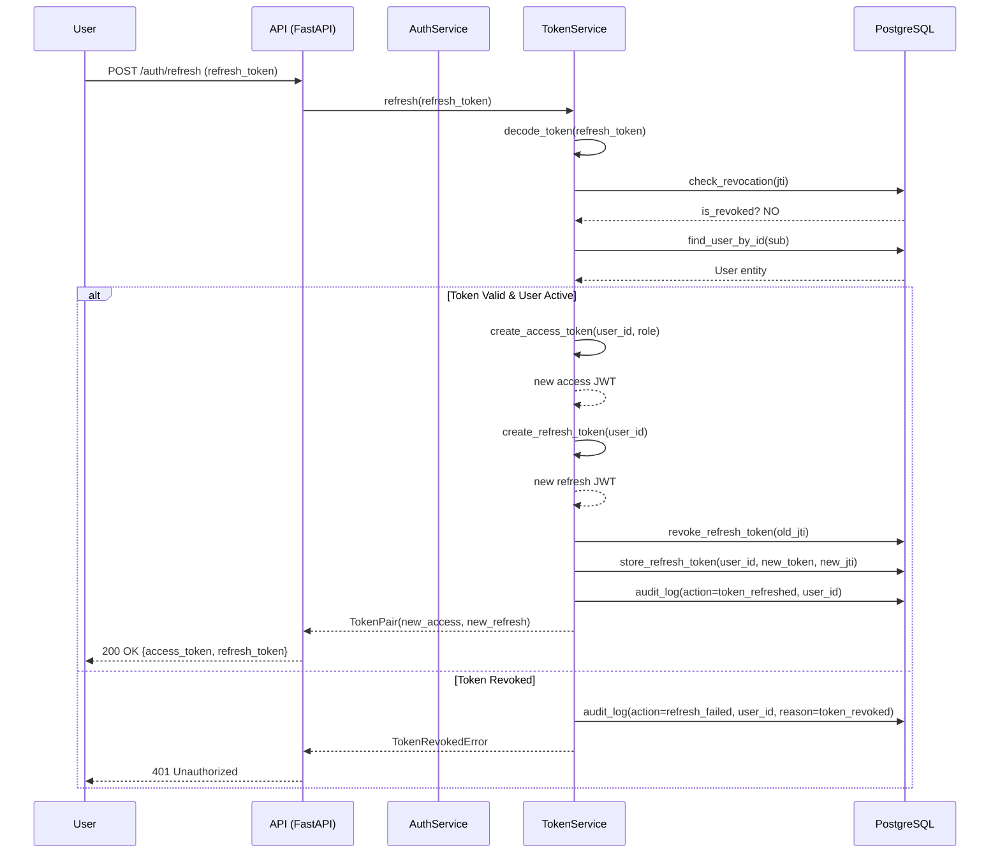
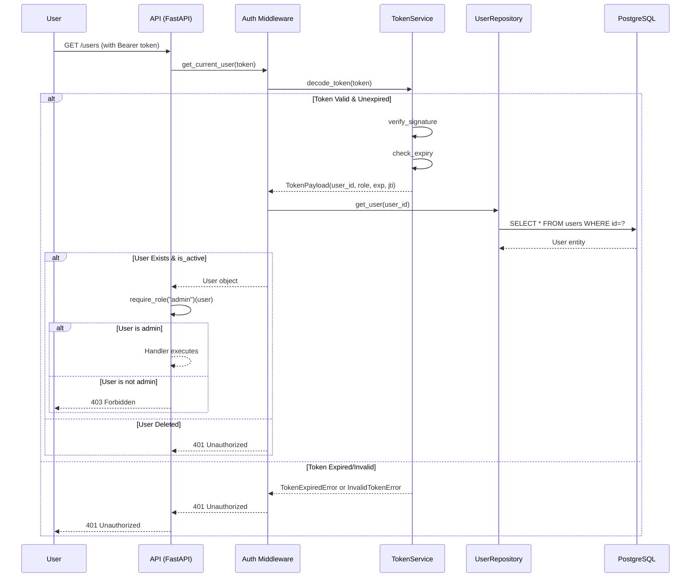

# Design Document: Epic 4 - Authentication & Authorization

## Overview

Epic 4 implements JWT-based authentication with role-based access control (RBAC) and audit logging for all security-relevant events. The design follows the approved Security Architecture (08-Security-Architecture.md §4–5), using stateless access tokens (15-minute lifetime) combined with revocable refresh tokens (30-day lifetime) for session management across multiple devices. All endpoints enforce either Bearer token authentication or RBAC middleware, and all security events are durably logged.

The implementation separates concerns across four core services:
- **PasswordHasher**: Cryptographic password hashing with constant-time verification (bcrypt/argon2id)
- **TokenService**: JWT creation, validation, and claim verification (HS256/RS256)
- **AuthService**: User registration, login, refresh, logout, and multi-device session lifecycle
- **AuditService**: Immutable, append-only logging of all auth/authz events

---

## System Architecture

### High-Level Flow



### JWT Token Lifecycle



### Token Refresh Flow (with Rotation)



### Authorization Check Flow



---

## Core Components

### 1. User Domain Entity

**Location:** `app/domain/entities/user.py`

The User entity represents an authenticated platform user. Unlike other domain entities (DigitalAsset, Analysis), User is deliberately mutable to support role changes and profile updates by authorized admins.

**Structure:**

```python
from dataclasses import dataclass
from datetime import datetime
from uuid import UUID
from typing import Optional
from enum import Enum

class UserRole(str, Enum):
    """Three roles defined in 02-Domain-Model.md §3"""
    ADMIN = "admin"
    ANALYST = "analyst"
    VIEWER = "viewer"

@dataclass
class User:
    """
    Immutable user identity with mutable profile attributes.
    
    Invariants:
    - id is immutable UUID
    - email is unique and immutable after creation
    - password_hash is never plaintext (verified via hashing algorithm, never substring match)
    - role is one of: admin, analyst, viewer
    - is_active controls authentication eligibility
    - created_at is immutable, set at creation
    """
    id: UUID
    email: str                    # Unique, immutable
    password_hash: str            # Non-reversible hash, never plaintext
    full_name: Optional[str]      # Mutable
    role: UserRole                # Mutable (admin-only change)
    is_active: bool               # Mutable (soft-delete when False)
    created_at: datetime          # Immutable
    updated_at: Optional[datetime] = None  # Updated on profile changes
    deleted_at: Optional[datetime] = None  # Soft-delete timestamp

    def validate(self) -> None:
        """Validate all invariants"""
        if not self.email:
            raise ValueError("Email is required")
        
        # Email format validation (RFC 5322 simplified)
        if "@" not in self.email or not self.email.split("@")[1]:
            raise ValueError("Invalid email format")
        
        # Role must be one of three values
        if self.role not in UserRole:
            raise ValueError(f"Role must be one of: {', '.join([r.value for r in UserRole])}")
        
        # password_hash should never be empty (would be set by hashing service)
        if not self.password_hash:
            raise ValueError("Password hash is required")

    def deactivate(self) -> 'User':
        """Soft-delete by marking inactive (authorization boundary)"""
        return User(
            id=self.id,
            email=self.email,
            password_hash=self.password_hash,
            full_name=self.full_name,
            role=self.role,
            is_active=False,
            created_at=self.created_at,
            updated_at=datetime.utcnow(),
            deleted_at=datetime.utcnow(),
        )

    def update_profile(self, full_name: Optional[str]) -> 'User':
        """Update mutable profile fields (non-admin)"""
        return User(
            id=self.id,
            email=self.email,
            password_hash=self.password_hash,
            full_name=full_name or self.full_name,
            role=self.role,
            is_active=self.is_active,
            created_at=self.created_at,
            updated_at=datetime.utcnow(),
            deleted_at=self.deleted_at,
        )

    def update_role(self, new_role: UserRole) -> 'User':
        """Update role (admin-only, but entity doesn't enforce — authorization boundary)"""
        return User(
            id=self.id,
            email=self.email,
            password_hash=self.password_hash,
            full_name=self.full_name,
            role=new_role,
            is_active=self.is_active,
            created_at=self.created_at,
            updated_at=datetime.utcnow(),
            deleted_at=self.deleted_at,
        )
```

---

### 2. Password Hashing Service

**Location:** `app/infrastructure/security/password.py`

Provides secure, adaptive password hashing with constant-time verification to prevent timing attacks (per 08-Security-Architecture.md §4).

**Structure:**

```python
import hmac
import hashlib
from abc import ABC, abstractmethod
from argon2 import PasswordHasher as Argon2PasswordHasher
from argon2.exceptions import VerifyMismatchError, InvalidHashError
from app.core.config import settings

class PasswordHasherInterface(ABC):
    """Abstract interface for password hashing implementations"""
    
    @abstractmethod
    def hash_password(self, plaintext: str) -> str:
        """Hash plaintext password. Salt is included in hash."""
        pass
    
    @abstractmethod
    def verify_password(self, plaintext: str, hash_value: str) -> bool:
        """Verify plaintext against hash. Constant-time comparison."""
        pass

class ArgonPasswordHasher(PasswordHasherInterface):
    """
    Password hashing using argon2id.
    
    Per 07-Backend-Development-Standards.md §11:
    - Work factor tuned for ~100ms computation on modern CPU
    - Uses argon2id (resistant to both GPU and side-channel attacks)
    - Salt is automatically generated and included in hash
    """
    
    def __init__(self):
        # Configure argon2id with work factor ~100ms
        self.hasher = Argon2PasswordHasher(
            time_cost=2,              # iterations
            memory_cost=65536,        # 64MB memory
            parallelism=4,            # 4 threads
            hash_len=16,
            salt_len=16,
        )
    
    def hash_password(self, plaintext: str) -> str:
        """
        Hash password using argon2id.
        
        Preconditions:
        - plaintext is non-empty string
        
        Postconditions:
        - Returns hash string (not equal to plaintext)
        - Salt is unique per call
        - Same plaintext produces different hash each time
        """
        if not plaintext:
            raise ValueError("Password cannot be empty")
        
        return self.hasher.hash(plaintext)
    
    def verify_password(self, plaintext: str, hash_value: str) -> bool:
        """
        Verify plaintext against hash using constant-time comparison.
        
        Preconditions:
        - plaintext is non-empty string
        - hash_value is valid argon2id hash
        
        Postconditions:
        - Returns True if match, False if mismatch
        - Execution time does NOT vary based on mismatch position (timing-attack resistant)
        """
        if not plaintext or not hash_value:
            return False
        
        try:
            # Argon2 library uses constant-time comparison internally
            self.hasher.verify(hash_value, plaintext)
            return True
        except (VerifyMismatchError, InvalidHashError):
            return False
    
    def needs_rehash(self, hash_value: str) -> bool:
        """Check if hash needs recomputation due to parameter changes"""
        return self.hasher.check_needs_rehash(hash_value)


class BcryptPasswordHasher(PasswordHasherInterface):
    """
    Alternative: bcrypt password hashing.
    
    Per 08-Security-Architecture.md §4:
    - Industry standard, widely used
    - Simpler than argon2id but still secure
    - Work factor (cost) tuned for ~100ms computation
    """
    
    def __init__(self, cost: int = 12):
        import bcrypt
        self.bcrypt = bcrypt
        self.cost = cost
    
    def hash_password(self, plaintext: str) -> str:
        """Hash using bcrypt with configured cost"""
        if not plaintext:
            raise ValueError("Password cannot be empty")
        
        salt = self.bcrypt.gensalt(rounds=self.cost)
        return self.bcrypt.hashpw(plaintext.encode(), salt).decode()
    
    def verify_password(self, plaintext: str, hash_value: str) -> bool:
        """Verify with constant-time comparison (bcrypt uses checkpw internally)"""
        if not plaintext or not hash_value:
            return False
        
        try:
            # bcrypt.checkpw uses constant-time comparison
            return self.bcrypt.checkpw(plaintext.encode(), hash_value.encode())
        except Exception:
            return False


# Factory: select hasher based on configuration
def get_password_hasher() -> PasswordHasherInterface:
    """
    Per 07-Backend-Development-Standards.md §11, algorithm is configured
    via settings. Default to argon2id.
    """
    algorithm = settings.PASSWORD_HASHING_ALGORITHM  # "argon2id" or "bcrypt"
    
    if algorithm == "argon2id":
        return ArgonPasswordHasher()
    elif algorithm == "bcrypt":
        return BcryptPasswordHasher(cost=12)
    else:
        raise ValueError(f"Unsupported algorithm: {algorithm}")
```

---

### 3. JWT Token Service

**Location:** `app/infrastructure/security/jwt.py`

Manages JWT creation, validation, and claim verification. Supports both HS256 (HMAC) and RS256 (RSA) algorithms per 08-Security-Architecture.md §4.

**Structure:**

```python
from datetime import datetime, timedelta, timezone
from typing import Optional, Dict, Any
from uuid import UUID, uuid4
import jwt
from jwt.exceptions import ExpiredSignatureError, InvalidTokenError as JWTInvalidTokenError

from app.core.config import settings
from app.domain.entities.user import UserRole

class TokenPayload:
    """Decoded JWT payload with all required claims"""
    
    def __init__(
        self,
        sub: UUID,           # subject (user_id)
        role: UserRole,
        exp: datetime,       # expiration time
        iat: datetime,       # issued at
        jti: str,            # JWT ID (unique token identifier)
    ):
        self.sub = sub
        self.role = role
        self.exp = exp
        self.iat = iat
        self.jti = jti
    
    def is_expired(self) -> bool:
        """Check if token is expired"""
        return datetime.now(timezone.utc) > self.exp


class TokenExpiredError(Exception):
    """Raised when token has expired"""
    pass


class InvalidTokenError(Exception):
    """Raised when token signature/structure is invalid"""
    pass


class TokenService:
    """
    JWT token management per 08-Security-Architecture.md §4.
    
    Access tokens: 15-minute lifetime, included in every request
    Refresh tokens: 30-day lifetime, used only on POST /auth/refresh
    
    Per 05-API-Specification.md §2 assumptions.
    """
    
    # Token lifetimes
    ACCESS_TOKEN_EXPIRY_MINUTES = 15
    REFRESH_TOKEN_EXPIRY_DAYS = 30
    
    def __init__(self):
        # Algorithm and key from settings (per 07-Backend-Development-Standards.md §11)
        self.algorithm = settings.JWT_ALGORITHM  # "HS256" or "RS256"
        
        if self.algorithm == "HS256":
            self.secret_key = settings.JWT_SECRET_KEY
            self.public_key = None
        elif self.algorithm == "RS256":
            self.secret_key = settings.JWT_PRIVATE_KEY
            self.public_key = settings.JWT_PUBLIC_KEY
        else:
            raise ValueError(f"Unsupported algorithm: {self.algorithm}")
    
    def create_access_token(self, user_id: UUID, role: UserRole) -> str:
        """
        Create short-lived access token (15 minutes).
        
        Postconditions:
        - JWT includes: sub, role, exp, iat, jti
        - Expiration is exactly 15 minutes from now
        - Token is signed with configured algorithm
        """
        now = datetime.now(timezone.utc)
        expiry = now + timedelta(minutes=self.ACCESS_TOKEN_EXPIRY_MINUTES)
        
        payload = {
            "sub": str(user_id),
            "role": role.value,
            "exp": expiry,
            "iat": now,
            "jti": str(uuid4()),  # Unique token ID for revocation tracking
        }
        
        key = self.secret_key if self.algorithm == "HS256" else self.secret_key
        token = jwt.encode(payload, key, algorithm=self.algorithm)
        return token
    
    def create_refresh_token(self, user_id: UUID) -> str:
        """
        Create long-lived refresh token (30 days).
        
        Postconditions:
        - JWT includes: sub, exp, iat, jti
        - Expiration is exactly 30 days from now
        - Token is signed with configured algorithm
        """
        now = datetime.now(timezone.utc)
        expiry = now + timedelta(days=self.REFRESH_TOKEN_EXPIRY_DAYS)
        
        payload = {
            "sub": str(user_id),
            "exp": expiry,
            "iat": now,
            "jti": str(uuid4()),  # Unique token ID for rotation/revocation
        }
        
        key = self.secret_key if self.algorithm == "HS256" else self.secret_key
        token = jwt.encode(payload, key, algorithm=self.algorithm)
        return token
    
    def decode_token(self, token: str) -> TokenPayload:
        """
        Decode and validate token.
        
        Postconditions:
        - Returns TokenPayload if valid and unexpired
        - Raises TokenExpiredError if exp < now
        - Raises InvalidTokenError if signature/structure invalid
        - Raises InvalidTokenError if required claims missing
        """
        try:
            key = self.public_key if self.algorithm == "RS256" else self.secret_key
            payload = jwt.decode(token, key, algorithms=[self.algorithm])
            
            # Validate required claims
            required_claims = ["sub", "exp", "iat", "jti"]
            if not all(claim in payload for claim in required_claims):
                raise InvalidTokenError("Missing required claims")
            
            exp = datetime.fromtimestamp(payload["exp"], tz=timezone.utc)
            iat = datetime.fromtimestamp(payload["iat"], tz=timezone.utc)
            
            # role is optional (refresh tokens don't have it)
            role_str = payload.get("role")
            role = UserRole(role_str) if role_str else None
            
            token_payload = TokenPayload(
                sub=UUID(payload["sub"]),
                role=role,
                exp=exp,
                iat=iat,
                jti=payload["jti"],
            )
            
            return token_payload
        
        except ExpiredSignatureError:
            raise TokenExpiredError("Token has expired")
        except JWTInvalidTokenError as e:
            raise InvalidTokenError(f"Invalid token: {str(e)}")
        except Exception as e:
            raise InvalidTokenError(f"Token decode failed: {str(e)}")
```


---

### 4. Authentication Service

**Location:** `app/application/services/auth_service.py`

High-level authentication orchestration: register, login, refresh, logout with audit logging.

**Key Methods:**

```python
class AuthService:
    """
    Orchestrates authentication lifecycle.
    Per Requirement 5 in requirements.md.
    """
    
    async def register(
        self,
        email: str,
        password: str,
        full_name: Optional[str],
    ) -> User:
        """
        Register new user.
        
        Raises:
        - DuplicateEmailError: if email already exists
        - ValidationError: if email format invalid or password too weak
        """
        # Validate email format
        if not email or "@" not in email:
            raise ValidationError("Invalid email format")
        
        # Check password strength (>= 12 characters per Requirement 5)
        if len(password) < 12:
            raise PasswordTooWeakError("Password must be at least 12 characters")
        
        # Check for duplicate email
        existing = await self.user_repository.find_by_email(email)
        if existing:
            raise DuplicateEmailError("Email already registered")
        
        # Hash password
        password_hash = self.password_hasher.hash_password(password)
        
        # Create user entity
        user = User(
            id=UUID(uuid4()),
            email=email.lower(),
            password_hash=password_hash,
            full_name=full_name,
            role=UserRole.VIEWER,  # Default role
            is_active=True,
            created_at=datetime.utcnow(),
        )
        
        user.validate()
        
        # Persist
        await self.user_repository.create(user)
        
        # Audit log
        await self.audit_service.log(
            action="user_registered",
            user_id=user.id,
            status="success",
        )
        
        return user
    
    async def login(self, email: str, password: str) -> TokenPair:
        """
        Authenticate user and issue tokens.
        
        Raises:
        - InvalidCredentialsError: if email not found, password wrong, or user inactive
          (does not distinguish between cases to prevent email enumeration)
        """
        # Find user
        user = await self.user_repository.find_by_email(email.lower())
        
        if not user:
            # User not found — log with email (user doesn't exist yet)
            await self.audit_service.log(
                action="login_failed",
                email=email,
                reason="user_not_found",
                status="failure",
            )
            raise InvalidCredentialsError("Invalid email or password")
        
        # Check if user is active
        if not user.is_active:
            await self.audit_service.log(
                action="login_failed",
                user_id=user.id,
                reason="user_inactive",
                status="failure",
            )
            raise InvalidCredentialsError("Invalid email or password")
        
        # Verify password (constant-time)
        if not self.password_hasher.verify_password(password, user.password_hash):
            await self.audit_service.log(
                action="login_failed",
                user_id=user.id,
                reason="invalid_password",
                status="failure",
            )
            raise InvalidCredentialsError("Invalid email or password")
        
        # Create tokens
        access_token = self.token_service.create_access_token(user.id, user.role)
        refresh_token = self.token_service.create_refresh_token(user.id)
        
        # Decode refresh token to get jti for storage
        refresh_payload = self.token_service.decode_token(refresh_token)
        
        # Store refresh token in database
        await self.refresh_token_repository.create(
            user_id=user.id,
            token_jti=refresh_payload.jti,
            expires_at=refresh_payload.exp,
        )
        
        # Audit log
        await self.audit_service.log(
            action="login_success",
            user_id=user.id,
            status="success",
        )
        
        return TokenPair(access_token=access_token, refresh_token=refresh_token)
    
    async def refresh(self, refresh_token: str) -> TokenPair:
        """
        Issue new token pair using valid refresh token.
        
        Implements token rotation:
        - Old refresh token is revoked immediately
        - New access and refresh tokens issued
        
        Raises:
        - TokenExpiredError: if refresh token expired
        - TokenRevokedError: if refresh token was revoked/not found
        """
        # Decode refresh token
        try:
            payload = self.token_service.decode_token(refresh_token)
        except TokenExpiredError:
            await self.audit_service.log(
                action="refresh_failed",
                reason="token_expired",
                status="failure",
            )
            raise
        except InvalidTokenError as e:
            await self.audit_service.log(
                action="refresh_failed",
                reason="invalid_token",
                status="failure",
            )
            raise TokenRevokedError("Invalid refresh token") from e
        
        # Check if refresh token is revoked
        token_record = await self.refresh_token_repository.find_by_jti(payload.jti)
        if not token_record or token_record.is_revoked:
            await self.audit_service.log(
                action="refresh_failed",
                user_id=payload.sub,
                reason="token_revoked",
                status="failure",
            )
            raise TokenRevokedError("Refresh token has been revoked")
        
        # Get user to verify still active
        user = await self.user_repository.get(payload.sub)
        if not user or not user.is_active:
            await self.audit_service.log(
                action="refresh_failed",
                user_id=payload.sub,
                reason="user_inactive",
                status="failure",
            )
            raise InvalidCredentialsError("User is inactive")
        
        # Revoke old refresh token
        await self.refresh_token_repository.revoke(payload.jti)
        
        # Issue new token pair
        new_access = self.token_service.create_access_token(user.id, user.role)
        new_refresh = self.token_service.create_refresh_token(user.id)
        
        # Store new refresh token
        new_refresh_payload = self.token_service.decode_token(new_refresh)
        await self.refresh_token_repository.create(
            user_id=user.id,
            token_jti=new_refresh_payload.jti,
            expires_at=new_refresh_payload.exp,
        )
        
        # Audit
        await self.audit_service.log(
            action="token_refreshed",
            user_id=user.id,
            status="success",
        )
        
        return TokenPair(access_token=new_access, refresh_token=new_refresh)
    
    async def logout(
        self,
        user_id: UUID,
        refresh_token: Optional[str] = None,
        logout_all: bool = False,
    ) -> None:
        """
        Revoke refresh token(s).
        
        If refresh_token provided: revoke only that token
        If logout_all=True: revoke all tokens for user
        """
        if logout_all:
            await self.refresh_token_repository.revoke_all_for_user(user_id)
            await self.audit_service.log(
                action="logout_all_sessions",
                user_id=user_id,
                status="success",
            )
        elif refresh_token:
            try:
                payload = self.token_service.decode_token(refresh_token)
                await self.refresh_token_repository.revoke(payload.jti)
                await self.audit_service.log(
                    action="logout",
                    user_id=user_id,
                    status="success",
                )
            except (TokenExpiredError, InvalidTokenError):
                # Still count as logout even if token is invalid
                await self.audit_service.log(
                    action="logout",
                    user_id=user_id,
                    status="success",
                )
```


---

### 5. Authentication Middleware (FastAPI Dependencies)

**Location:** `app/api/v1/dependencies/auth.py`

Declarative dependency injection for FastAPI route handlers per 07-Backend-Development-Standards.md §4.

**Structure:**

```python
from fastapi import Depends, HTTPException, Header
from typing import Optional, List
from uuid import UUID

async def get_current_user(
    authorization: Optional[str] = Header(None),
    token_service: TokenService = Depends(get_token_service),
    user_repository: UserRepository = Depends(get_user_repository),
) -> User:
    """
    FastAPI dependency that extracts and validates Bearer token.
    
    Preconditions:
    - Authorization header contains 'Bearer <token>'
    
    Postconditions:
    - Returns User object if token valid and user exists/active
    - Raises 401 if token missing, malformed, expired, or invalid
    - Raises 401 if user not found or inactive
    """
    if not authorization:
        raise HTTPException(status_code=401, detail="Missing authentication token")
    
    # Parse Bearer token
    parts = authorization.split()
    if len(parts) != 2 or parts[0].lower() != "bearer":
        raise HTTPException(status_code=401, detail="Invalid authorization header format")
    
    token = parts[1]
    
    # Decode token
    try:
        payload = token_service.decode_token(token)
    except TokenExpiredError:
        raise HTTPException(status_code=401, detail="Token has expired")
    except InvalidTokenError:
        raise HTTPException(status_code=401, detail="Invalid token")
    
    # Load user from database (never trust token claims alone)
    user = await user_repository.get(payload.sub)
    if not user or not user.is_active:
        raise HTTPException(status_code=401, detail="User not found or inactive")
    
    return user


def require_role(required_roles: Union[str, List[str]]) -> Callable:
    """
    Factory that returns a dependency checking user role.
    
    Usage:
    - require_role("admin")
    - require_role(["admin", "analyst"])
    """
    if isinstance(required_roles, str):
        required_roles = [required_roles]
    
    async def check_role(user: User = Depends(get_current_user)) -> User:
        if user.role.value not in required_roles:
            raise HTTPException(status_code=403, detail="Insufficient permissions")
        return user
    
    return check_role
```

**Usage in route handlers:**

```python
@router.get("/users", tags=["users"])
async def list_users(
    user: User = Depends(require_role("admin")),
) -> List[UserResponse]:
    """Admin-only endpoint"""
    return await user_service.list_users()
```


---

### 6. Audit Service

**Location:** `app/application/services/audit_service.py`

Immutable append-only audit logging per 08-Security-Architecture.md §2.

**Structure:**

```python
from datetime import datetime, timezone
from enum import Enum
from typing import Optional, Any, Dict
from uuid import UUID
from dataclasses import dataclass

class AuditAction(str, Enum):
    """All possible audit log actions"""
    USER_REGISTERED = "user_registered"
    LOGIN_SUCCESS = "login_success"
    LOGIN_FAILED = "login_failed"
    TOKEN_REFRESHED = "token_refreshed"
    REFRESH_FAILED = "refresh_failed"
    LOGOUT = "logout"
    LOGOUT_ALL_SESSIONS = "logout_all_sessions"
    USER_CREATED_BY_ADMIN = "user_created_by_admin"
    USER_PROFILE_UPDATED = "user_profile_updated"
    USER_ROLE_CHANGED = "user_role_changed"
    USER_DEACTIVATED = "user_deactivated"
    ANALYSIS_REQUESTED = "analysis_requested"
    ANALYSIS_COMPLETED = "analysis_completed"

@dataclass
class AuditLogEntry:
    """Single immutable audit log entry"""
    id: UUID
    timestamp: datetime            # Server time, never client-supplied
    action: AuditAction
    user_id: Optional[UUID]        # Actor (null for register/login before user exists)
    target_user_id: Optional[UUID] # User being modified (for admin actions)
    resource_type: Optional[str]   # e.g., "user", "analysis", "upload"
    resource_id: Optional[UUID]
    status: str                    # "success" or "failure"
    ip_address: Optional[str]
    reason: Optional[str]          # For failures: why
    details: Dict[str, Any]        # Additional context (JSON)

class AuditService:
    """
    Write-only audit logging. No update or delete operations.
    Per 08-Security-Architecture.md §2, 10.
    """
    
    def __init__(self, repository: AuditLogRepository):
        self.repository = repository
    
    async def log(
        self,
        action: AuditAction,
        user_id: Optional[UUID] = None,
        target_user_id: Optional[UUID] = None,
        resource_type: Optional[str] = None,
        resource_id: Optional[UUID] = None,
        status: str = "success",
        ip_address: Optional[str] = None,
        reason: Optional[str] = None,
        details: Optional[Dict[str, Any]] = None,
    ) -> AuditLogEntry:
        """
        Create immutable audit log entry.
        
        Postconditions:
        - Entry is written to database and never modified/deleted
        - Timestamp is server-generated (UTC)
        - All fields are populated
        """
        entry = AuditLogEntry(
            id=UUID(uuid4()),
            timestamp=datetime.now(timezone.utc),
            action=action,
            user_id=user_id,
            target_user_id=target_user_id,
            resource_type=resource_type,
            resource_id=resource_id,
            status=status,
            ip_address=ip_address,
            reason=reason,
            details=details or {},
        )
        
        try:
            await self.repository.create(entry)
        except Exception as e:
            # Fail-safe: log audit failure but do NOT block the operation
            logger.error(f"Audit log write failed: {str(e)}", extra={"entry": entry})
        
        return entry
```


---

## Data Flow Diagrams

### Login Sequence

```
Client                           API                         Services                  Database
  |                               |                             |                         |
  +--POST /auth/login------------>|                             |                         |
  |  (email, password)            |                             |                         |
  |                               +--login()------------------>|                         |
  |                               |  (email, password)          |                         |
  |                               |                             +--find_user(email)----->|
  |                               |                             |<-----User entity--------|
  |                               |                             |                         |
  |                               |                             +--verify_password()     |
  |                               |                             |  (constant-time)       |
  |                               |<------TokenPair-------------|                         |
  |                               |  (access, refresh)         +--store_refresh_token-->|
  |                               |                             |  (jti, user_id)        |
  |                               |                             +--audit_log()---------->|
  |<--200 OK + TokenPair----------|                             |  (action=login_success)|
  |  { access_token, refresh_token }                             |                        |
```

### Token Refresh with Rotation

```
Client                           API                         Services                  Database
  |                               |                             |                         |
  +--POST /auth/refresh---------->|                             |                         |
  |  (refresh_token)              |                             |                         |
  |                               +--refresh()--------------->|                         |
  |                               |  (refresh_token)            |                         |
  |                               |                             +--decode_token()        |
  |                               |                             |                         |
  |                               |                             +--check_revocation()-->|
  |                               |                             |  (jti in revocation)   |
  |                               |                             |<-----is_revoked-------|
  |                               |                             |                         |
  |                               |                             +--get_user(user_id)--->|
  |                               |                             |<-----User entity--------|
  |                               |                             |                         |
  |                               |                             +--create_access_token() |
  |                               |                             +--create_refresh_token()|
  |                               |                             |                         |
  |                               |                             +--revoke_old_token()-->|
  |                               |                             |  (old_jti)             |
  |                               |                             |                         |
  |                               |                             +--store_new_token()-->|
  |                               |                             |  (new_jti)             |
  |<--200 OK + new TokenPair------|                             |                         |
  |  { new_access, new_refresh }   +--audit_log()------------>|                         |
  |                                |                          |  (action=token_refreshed)|
```

### Authorization Check

```
Client                           API                         Services                  Database
  |                               |                             |                         |
  +--GET /admin-endpoint--------->|                             |                         |
  |  Bearer <access_token>        |                             |                         |
  |                               +--get_current_user()------->|                         |
  |                               |  (token)                    |                         |
  |                               |                             +--decode_token()        |
  |                               |                             |  (validate exp, sig)    |
  |                               |                             |                         |
  |                               |                             +--get_user(user_id)--->|
  |                               |                             |<-----User entity--------|
  |                               |                             |  (check is_active)      |
  |                               |<------User object-----------|                         |
  |                               |                             |                         |
  |                               +--require_role("admin")      |                         |
  |                               |  (check user.role)          |                         |
  |                               |                             |                         |
  | (If role matches)             |                             |                         |
  |<--200 OK + response-----------|                             |                         |
  |                               |                             |                         |
  | (If role doesn't match)       |                             |                         |
  |<--403 Forbidden--------------->|                             |                         |
```

---

## API Contract Overview

### Authentication Endpoints

**POST /auth/register** (public)
```
Request:
{
  "email": "user@example.com",
  "password": "SecurePass123",
  "full_name": "John Doe"
}

Response (201 Created):
{
  "id": "uuid",
  "email": "user@example.com",
  "full_name": "John Doe",
  "role": "viewer",
  "created_at": "2024-01-15T10:30:00Z"
}

Error (409 Conflict):
{
  "type": "about:blank",
  "title": "Conflict",
  "status": 409,
  "detail": "Email already registered"
}
```

**POST /auth/login** (public)
```
Request:
{
  "email": "user@example.com",
  "password": "SecurePass123"
}

Response (200 OK):
{
  "access_token": "eyJhbGc...",
  "refresh_token": "eyJhbGc...",
  "token_type": "Bearer",
  "expires_in": 900
}

Error (401 Unauthorized):
{
  "type": "about:blank",
  "title": "Unauthorized",
  "status": 401,
  "detail": "Invalid email or password"
}
```

**POST /auth/refresh** (refresh-token authenticated)
```
Request:
{
  "refresh_token": "eyJhbGc..."
}

Response (200 OK):
{
  "access_token": "eyJhbGc...",
  "refresh_token": "eyJhbGc...",
  "token_type": "Bearer",
  "expires_in": 900
}
```

**POST /auth/logout** (access-token authenticated)
```
Request (logout single device):
{
  "refresh_token": "eyJhbGc..."
}

Request (logout all devices):
{
  "logout_all": true
}

Response (204 No Content):
(empty body)
```

**GET /auth/me** (access-token authenticated)
```
Response (200 OK):
{
  "id": "uuid",
  "email": "user@example.com",
  "full_name": "John Doe",
  "role": "viewer",
  "created_at": "2024-01-15T10:30:00Z"
}
```

### User Management Endpoints

**GET /users** (admin-only)
```
Response (200 OK):
{
  "items": [
    {
      "id": "uuid",
      "email": "user@example.com",
      "full_name": "John Doe",
      "role": "viewer",
      "is_active": true,
      "created_at": "2024-01-15T10:30:00Z"
    }
  ],
  "total": 1,
  "page": 1,
  "size": 50
}
```

**GET /users/{userId}** (admin or owner)
```
Response (200 OK):
{
  "id": "uuid",
  "email": "user@example.com",
  "full_name": "John Doe",
  "role": "viewer",
  "is_active": true,
  "created_at": "2024-01-15T10:30:00Z"
}

Error (404 Not Found): if user is not accessible
```

**PATCH /users/{userId}** (admin or owner, with restrictions)
```
Request (non-admin updates own profile):
{
  "full_name": "Jane Doe"
}

Request (admin updates other user):
{
  "full_name": "Jane Doe",
  "role": "analyst"
}

Response (200 OK):
{
  "id": "uuid",
  "email": "user@example.com",
  "full_name": "Jane Doe",
  "role": "analyst",
  "is_active": true,
  "created_at": "2024-01-15T10:30:00Z"
}

Error (403 Forbidden): if non-admin tries to change role
```

**DELETE /users/{userId}** (admin-only)
```
Response (204 No Content):
(empty body)

After soft-delete, GET /users/{userId} returns 404
```

### Audit Log Endpoints

**GET /audit-logs** (admin-only, paginated)
```
Query parameters:
- user_id (optional): filter by user
- action (optional): filter by action type
- from_date (optional): start timestamp
- to_date (optional): end timestamp
- page (default 1)
- size (default 50)

Response (200 OK):
{
  "items": [
    {
      "id": "uuid",
      "timestamp": "2024-01-15T10:30:00Z",
      "action": "login_success",
      "user_id": "uuid",
      "target_user_id": null,
      "resource_type": null,
      "resource_id": null,
      "status": "success",
      "ip_address": "192.168.1.1",
      "reason": null,
      "details": {}
    }
  ],
  "total": 42,
  "page": 1,
  "size": 50
}
```

**GET /audit-logs/{auditLogId}** (admin-only)
```
Response (200 OK):
{
  "id": "uuid",
  "timestamp": "2024-01-15T10:30:00Z",
  "action": "user_role_changed",
  "user_id": "admin-uuid",
  "target_user_id": "user-uuid",
  "resource_type": "user",
  "resource_id": "user-uuid",
  "status": "success",
  "ip_address": "192.168.1.1",
  "reason": null,
  "details": {
    "old_role": "viewer",
    "new_role": "analyst"
  }
}
```


---

## Security Design Details

### Constant-Time Password Verification

**Threat Mitigated:** Timing attacks where an attacker measures response time to narrow password search space (per 08-Security-Architecture.md §3).

**Implementation:**

- Both argon2id and bcrypt libraries use constant-time comparison internally (`hmac.compare_digest()` or equivalent)
- Never compare passwords with `==` operator — execution time would vary based on where first mismatch occurs
- Test: Measure timing of correct vs. incorrect password verification; variance < 5% per statistical analysis

**Design Decision:** Use library-provided constant-time verification; do not implement custom comparison.

### Token Signing Algorithm

**Options:** HS256 (HMAC) vs. RS256 (RSA)

**Decision:** Configurable via `settings.JWT_ALGORITHM`, default HS256 per 07-Backend-Development-Standards.md §11.

**Rationale:**
- **HS256 (HMAC)**: Simpler, faster, requires only shared secret. All service instances use same key.
- **RS256 (RSA)**: Supports key rotation without exposing private key to microservices. Public key can be distributed to all services for verification.

**Implementation:** TokenService reads algorithm and key(s) from settings; PyJWT library handles both.

### Refresh Token Revocation List

**Design:** Store refresh tokens in `refresh_tokens` table with state (active/revoked).

**Rationale:**
- Refresh tokens are long-lived (30 days); cannot rely on expiry alone for immediate session termination
- Logout must revoke token immediately; checked on every refresh call
- Revocation list is bounded (only includes issued tokens); queries are fast

**Table Schema:**

```sql
CREATE TABLE refresh_tokens (
    id UUID PRIMARY KEY,
    user_id UUID NOT NULL REFERENCES users(id),
    token_jti VARCHAR(255) UNIQUE NOT NULL,  -- JWT ID claim
    is_revoked BOOLEAN DEFAULT FALSE,
    expires_at TIMESTAMP NOT NULL,           -- When token naturally expires
    created_at TIMESTAMP DEFAULT NOW(),
    revoked_at TIMESTAMP NULL,
    CONSTRAINT no_update CHECK (is_revoked != TRUE OR revoked_at IS NOT NULL)
);

-- Check revocation on every refresh: O(1) lookup by jti
CREATE INDEX idx_refresh_tokens_jti ON refresh_tokens(token_jti);
```

**Revocation Process:**
1. On logout: set `is_revoked=True`, `revoked_at=now()`
2. On refresh: query by `jti`, check `is_revoked`, return 401 if true
3. On user deactivation: revoke all tokens for user

### Role-Based Access Control Enforcement

**Three Roles (per 02-Domain-Model.md §3):**

| Role | Capabilities |
|------|-------------|
| **admin** | User management, audit logs, all analyst + viewer capabilities |
| **analyst** | Upload files, request analyses, view own uploads/analyses/reports, view shared reports |
| **viewer** | View shared reports, view shared analyses, view own profile only |

**Enforcement Points:**

1. **Middleware (API Layer)**: `require_role("admin")` dependency on route
2. **Application Layer**: Role check in service methods (defense in depth)
3. **Domain Layer**: No role checks (authorization is not a domain rule)

**Example Implementation:**

```python
# Route handler
@router.get("/audit-logs")
async def get_audit_logs(
    user: User = Depends(require_role("admin")),
    service: AuditService = Depends(get_audit_service),
):
    return await service.list_logs()

# Service layer (redundant check for defense in depth)
async def list_logs(self, user: User) -> List[AuditLogEntry]:
    if user.role != UserRole.ADMIN:
        raise AuthorizationError("Only admins can access audit logs")
    # ... fetch and return
```

### Resource Ownership Validation

**Pattern:** Non-admin access to user resources requires ownership verification.

**Implementation:**

```python
# Get user profile: admin can see anyone, user can see self
async def get_user(user_id: UUID, requesting_user: User):
    if requesting_user.role != UserRole.ADMIN and requesting_user.id != user_id:
        raise HTTPException(status_code=404)  # 404, not 403, prevents enumeration
    return await user_repository.get(user_id)
```

### Audit Logging for All Auth Events

**Events Logged:**

- `user_registered`: register endpoint succeeds
- `login_success`: login succeeds
- `login_failed`: login fails (with reason: user_not_found, invalid_password, user_inactive)
- `token_refreshed`: refresh endpoint succeeds
- `refresh_failed`: refresh fails (with reason: token_expired, token_revoked, user_inactive)
- `logout`: logout endpoint called
- `logout_all_sessions`: logout all devices endpoint called
- `user_profile_updated`: PATCH /users/{userId} for profile fields
- `user_role_changed`: admin updates user role (includes old_role, new_role in details)
- `user_deactivated`: admin deletes user via soft-delete

**Immutability Guarantee:**

- No UPDATE or DELETE endpoints on audit log table
- Database constraint: audit table lacks UPDATE permission for application role
- Application: no delete method in AuditLogRepository

---

## Testing Strategy

### Unit Tests

**PasswordHasher:**
- Hash same password twice → different hashes (due to salting)
- Verify correct password → True
- Verify incorrect password → False
- Verify constant-time: measure timing distribution, variance < 5%
- Verify no plaintext in logs

**TokenService:**
- Create access token → includes sub, role, exp, iat, jti
- Create refresh token → includes sub, exp, iat, jti (no role)
- Decode valid token → returns TokenPayload with all claims
- Decode expired token → raises TokenExpiredError
- Decode invalid signature → raises InvalidTokenError
- Decode missing claims → raises InvalidTokenError

**AuthService:**
- Register new user → creates user with viewer role
- Register duplicate email → raises DuplicateEmailError
- Register weak password → raises PasswordTooWeakError
- Login valid credentials → returns TokenPair
- Login invalid password → raises InvalidCredentialsError (generic)
- Login inactive user → raises InvalidCredentialsError (generic)
- Refresh valid token → returns new TokenPair, old token revoked
- Refresh revoked token → raises TokenRevokedError
- Refresh expired token → raises TokenExpiredError
- Logout revokes token → refresh with old token fails

### Integration Tests

**Full Login Flow:**
- Create user → login → receive tokens → verify tokens decode correctly

**Full Refresh Flow:**
- Login → refresh → new tokens issued → old token revoked → retry with old token fails

**Full Logout Flow:**
- Login → logout → refresh with old token fails

**Multi-Device Session:**
- User 1 logs in from device A → gets token pair A
- Same user logs in from device B → gets token pair B
- Logout from device A → token A revoked
- Device B can still refresh with token B

**Role-Based Access:**
- Admin can list users → 200 OK
- Analyst tries to list users → 403 Forbidden
- Admin deactivates user → user cannot login
- Admin changes role → user has new permissions immediately

### Property-Based Tests (using fast-check or Hypothesis)

**Property 1: Password Hash Idempotence**
- *For any* correct password, `verify(password, hash(password))` returns True
- *For any* incorrect password, `verify(incorrect, hash(correct))` returns False

**Property 2: Token Round-Trip**
- *For any* valid user_id and role, `decode(create_access_token(user_id, role))` returns TokenPayload with same user_id and role

**Property 3: Refresh Token Rotation**
- *For any* valid refresh token, calling refresh twice produces two different refresh tokens

**Property 4: Revocation is Immediate**
- *For any* refresh token, after calling logout(token), subsequent refresh(token) fails with TokenRevokedError

**Property 5: Inactive User Cannot Authenticate**
- *For any* inactive user, login with correct password fails with InvalidCredentialsError
- *For any* inactive user, token validation fails with 401 Unauthorized


---

## Correctness Properties

*A correctness property is a formal statement that should hold true across all valid executions — the bridge between requirements and automated verification.*

### Property 1: Password Hash Verification is Correct

*For any* plaintext password and any valid password hash, verification with the correct plaintext returns True, and verification with any incorrect plaintext returns False.

**Validates: Requirements 2.4, 2.5**

### Property 2: Token Creation Includes All Required Claims

*For any* valid user_id and role, an access token created via `create_access_token(user_id, role)` decodes to a TokenPayload containing exactly the required claims: sub, role, exp, iat, jti.

**Validates: Requirements 3.2, 3.3**

### Property 3: Token Expiration is Enforced

*For any* token with an expiration time in the past, attempting to decode the token raises TokenExpiredError.

**Validates: Requirements 3.8**

### Property 4: Token Signature Validation Catches Tampering

*For any* valid token and any modification to the token string (excluding the signature portion), attempting to decode the modified token raises InvalidTokenError.

**Validates: Requirements 3.9**

### Property 5: Refresh Token Revocation is Immediate

*For any* refresh token that has been explicitly revoked via logout, attempting to use that token on a subsequent refresh call raises TokenRevokedError and does not issue new tokens.

**Validates: Requirements 5.9, 5.11, 10.5**

### Property 6: Authentication Middleware Rejects Inactive Users

*For any* valid JWT token belonging to a user whose is_active field is False, the get_current_user dependency raises 401 Unauthorized.

**Validates: Requirements 4.8, 10.7**

### Property 7: Role-Based Access Control Enforces Permissions

*For any* non-admin user attempting to access an admin-only endpoint, the require_role("admin") dependency raises 403 Forbidden.

**Validates: Requirements 4.11, 9.6**

### Property 8: Login Records Audit Log

*For any* login attempt (successful or failed), an AuditLog entry is created with the correct action, status, and reason fields.

**Validates: Requirements 5.13, 8.1**

### Property 9: Soft Delete Excludes Users from Queries

*For any* user marked as is_active=False, that user does not appear in `GET /users` paginated results and returns 404 on direct GET /users/{userId}.

**Validates: Requirements 7.11, 1.7**

### Property 10: Bearer Token Extraction is Robust

*For any* malformed Authorization header (missing, missing Bearer prefix, empty token), the get_current_user dependency raises 401 Unauthorized.

**Validates: Requirements 4.2, 4.3**

---

## Data Persistence Design

### Repository Interfaces

**Location:** `app/domain/repositories/`

```python
# User Repository
class UserRepository(ABC):
    @abstractmethod
    async def create(self, user: User) -> User: pass
    
    @abstractmethod
    async def get(self, user_id: UUID) -> Optional[User]: pass
    
    @abstractmethod
    async def find_by_email(self, email: str) -> Optional[User]: pass
    
    @abstractmethod
    async def list(self, skip: int = 0, limit: int = 50) -> List[User]: pass
    
    @abstractmethod
    async def update(self, user: User) -> User: pass
    
    @abstractmethod
    async def count(self) -> int: pass


# Refresh Token Repository
class RefreshTokenRepository(ABC):
    @abstractmethod
    async def create(self, user_id: UUID, token_jti: str, expires_at: datetime) -> None: pass
    
    @abstractmethod
    async def find_by_jti(self, jti: str) -> Optional[Dict]: pass
    
    @abstractmethod
    async def revoke(self, jti: str) -> None: pass
    
    @abstractmethod
    async def revoke_all_for_user(self, user_id: UUID) -> None: pass
    
    @abstractmethod
    async def cleanup_expired(self) -> int:
        """Remove expired tokens (background task)"""
        pass


# Audit Log Repository
class AuditLogRepository(ABC):
    @abstractmethod
    async def create(self, entry: AuditLogEntry) -> AuditLogEntry: pass
    
    @abstractmethod
    async def get(self, log_id: UUID) -> Optional[AuditLogEntry]: pass
    
    @abstractmethod
    async def list(
        self,
        user_id: Optional[UUID] = None,
        action: Optional[str] = None,
        from_timestamp: Optional[datetime] = None,
        to_timestamp: Optional[datetime] = None,
        skip: int = 0,
        limit: int = 50,
    ) -> List[AuditLogEntry]: pass
    
    @abstractmethod
    async def count(
        self,
        user_id: Optional[UUID] = None,
        action: Optional[str] = None,
    ) -> int: pass
```

### SQLAlchemy ORM Models

**Location:** `app/infrastructure/persistence/models/`

```python
# User ORM Model
class UserORM(Base):
    __tablename__ = "users"
    
    id = Column(UUID, primary_key=True)
    email = Column(String(255), unique=True, nullable=False, index=True)
    password_hash = Column(String(255), nullable=False)
    full_name = Column(String(255), nullable=True)
    role = Column(String(50), nullable=False)  # admin, analyst, viewer
    is_active = Column(Boolean, default=True)
    created_at = Column(DateTime, default=datetime.utcnow)
    updated_at = Column(DateTime, default=datetime.utcnow, onupdate=datetime.utcnow)
    deleted_at = Column(DateTime, nullable=True)
    
    def to_domain(self) -> User:
        return User(
            id=self.id,
            email=self.email,
            password_hash=self.password_hash,
            full_name=self.full_name,
            role=UserRole(self.role),
            is_active=self.is_active,
            created_at=self.created_at,
            updated_at=self.updated_at,
            deleted_at=self.deleted_at,
        )


# Refresh Token ORM Model
class RefreshTokenORM(Base):
    __tablename__ = "refresh_tokens"
    
    id = Column(UUID, primary_key=True)
    user_id = Column(UUID, ForeignKey("users.id"), nullable=False, index=True)
    token_jti = Column(String(255), unique=True, nullable=False, index=True)
    is_revoked = Column(Boolean, default=False)
    expires_at = Column(DateTime, nullable=False)
    created_at = Column(DateTime, default=datetime.utcnow)
    revoked_at = Column(DateTime, nullable=True)


# Audit Log ORM Model
class AuditLogORM(Base):
    __tablename__ = "audit_logs"
    
    id = Column(UUID, primary_key=True)
    timestamp = Column(DateTime, nullable=False, index=True)
    action = Column(String(100), nullable=False, index=True)
    user_id = Column(UUID, ForeignKey("users.id"), nullable=True, index=True)
    target_user_id = Column(UUID, ForeignKey("users.id"), nullable=True)
    resource_type = Column(String(50), nullable=True)
    resource_id = Column(UUID, nullable=True)
    status = Column(String(20), nullable=False)  # success, failure
    ip_address = Column(String(45), nullable=True)  # IPv4 or IPv6
    reason = Column(String(255), nullable=True)
    details = Column(JSON, default={})
    
    # Add index on timestamp for forensic queries
    __table_args__ = (
        Index('idx_audit_logs_timestamp', 'timestamp'),
        Index('idx_audit_logs_user_action', 'user_id', 'action'),
    )
    
    # Immutability: no UPDATE/DELETE permissions at database level
    # (enforced via PostgreSQL role permissions in migration)
```

---

## Configuration & Environment

**Settings** (`app/core/config.py`):

```python
class Settings:
    # Password hashing
    PASSWORD_HASHING_ALGORITHM: str = "argon2id"  # "argon2id" or "bcrypt"
    
    # JWT
    JWT_ALGORITHM: str = "HS256"  # "HS256" or "RS256"
    JWT_SECRET_KEY: str  # Read from environment, >= 32 bytes
    JWT_PRIVATE_KEY: Optional[str] = None  # For RS256
    JWT_PUBLIC_KEY: Optional[str] = None   # For RS256
    
    # Token lifetimes (minutes/days)
    ACCESS_TOKEN_EXPIRY_MINUTES: int = 15
    REFRESH_TOKEN_EXPIRY_DAYS: int = 30
    
    # RBAC roles (fixed)
    VALID_ROLES: List[str] = ["admin", "analyst", "viewer"]
```

**.env example:**

```bash
# Password Hashing
PASSWORD_HASHING_ALGORITHM=argon2id

# JWT
JWT_ALGORITHM=HS256
JWT_SECRET_KEY=your-secret-key-at-least-32-bytes-long-for-hmac
# For RS256 (if using):
# JWT_PRIVATE_KEY=<base64-encoded-private-key>
# JWT_PUBLIC_KEY=<base64-encoded-public-key>

# Token Lifetimes
ACCESS_TOKEN_EXPIRY_MINUTES=15
REFRESH_TOKEN_EXPIRY_DAYS=30
```

---

## Error Handling & RFC 7807 Problem Details

All authentication/authorization errors follow RFC 7807 Problem Details format:

```json
{
  "type": "about:blank",
  "title": "Unauthorized",
  "status": 401,
  "detail": "Invalid email or password",
  "instance": "/auth/login"
}
```

**Standardized Errors:**

| Scenario | Status | Detail |
|----------|--------|--------|
| Missing token | 401 | Missing authentication token |
| Invalid format | 401 | Invalid authorization header format |
| Expired token | 401 | Token has expired |
| Invalid signature | 401 | Invalid token |
| User not found | 401 | User not found or inactive |
| Invalid credentials | 401 | Invalid email or password |
| Insufficient role | 403 | Insufficient permissions |
| Duplicate email | 409 | Email already registered |
| Weak password | 400 | Password must be at least 12 characters |
| Malformed JSON | 400 | <validation detail> |

---

## Implementation Order & Dependencies

1. **Domain Layer** (isolated, no dependencies)
   - User entity with validation
   - UserRole enum

2. **Infrastructure/Security** (implements domain interfaces)
   - PasswordHasher (argon2id/bcrypt)
   - TokenService (JWT creation/validation)

3. **Infrastructure/Persistence**
   - UserRepository
   - RefreshTokenRepository
   - AuditLogRepository

4. **Application Services**
   - AuthService (uses PasswordHasher, TokenService, repositories)
   - AuditService (uses AuditLogRepository)

5. **API Layer**
   - Authentication middleware (get_current_user, require_role)
   - Auth route handlers (register, login, refresh, logout, me)
   - User management routes (list, get, update, delete)
   - Audit log routes (list, get)

6. **Testing**
   - Unit tests for each service in isolation
   - Integration tests for full flows
   - Property-based tests for universal properties

---

## Security Checklist

- [ ] Password verification uses constant-time comparison (timing-attack resistant)
- [ ] JWT secret key is >= 32 bytes and sourced from environment
- [ ] No passwords or tokens logged in any logs
- [ ] Refresh token revocation checked on every refresh call
- [ ] Inactive users cannot authenticate (re-checked on every request)
- [ ] Audit logs are immutable (no update/delete endpoints)
- [ ] Role is never trusted from request body (only from validated JWT)
- [ ] 404 responses used instead of 403 for resource enumeration prevention
- [ ] All errors use RFC 7807 format (no stack traces in responses)
- [ ] HTTPS enforced (non-negotiable per 08-Security-Architecture.md §7)
- [ ] Rate limiting implemented on /auth/login endpoint (future enhancement)


---

## Dependencies & External Libraries

**Core Libraries:**
- `python-jose` + `cryptography` or `PyJWT`: JWT token creation/validation
- `argon2-cffi`: Argon2id password hashing (primary)
- `bcrypt`: Bcrypt password hashing (alternative)
- `FastAPI`: Web framework (already present from E2)
- `SQLAlchemy`: ORM (already present from E3)
- `Pydantic`: Request/response validation (already present from E2)

**Testing Libraries (development only):**
- `pytest`: Unit test framework
- `pytest-asyncio`: Async test support
- `pytest-cov`: Coverage reporting
- `fast-check` (Python): Property-based testing
- `hypothesis`: Alternative property-based testing library
- `faker`: Test data generation

**No Custom Cryptography:** Use established libraries only; never implement custom crypto.

---

## Alignment with Architecture Documents

**Requirement Traceability:**

| Requirement | Design Section | Implementation |
|-------------|-----------------|-----------------|
| 1. User Entity | User Domain Entity | `app/domain/entities/user.py` |
| 2. Password Hashing | Password Hashing Service | `app/infrastructure/security/password.py` |
| 3. JWT Token Service | JWT Token Service | `app/infrastructure/security/jwt.py` |
| 4. Auth Middleware | Authentication Middleware | `app/api/v1/dependencies/auth.py` |
| 5. Auth Service | Authentication Service | `app/application/services/auth_service.py` |
| 6. Auth Routes | API Contract Overview | `app/api/v1/routes/auth.py` |
| 7. User Management | API Contract Overview | `app/api/v1/routes/users.py` |
| 8. Audit Logging | Audit Service | `app/application/services/audit_service.py`, `app/api/v1/routes/audit_logs.py` |
| 9. RBAC Enforcement | Authorization Check Flow | `app/api/v1/dependencies/auth.py` (require_role) |
| 10. Session Lifecycle | Token Refresh Flow | `AuthService.refresh()`, `RefreshTokenRepository` |

**Architecture References:**

- **08-Security-Architecture.md §2** → Immutable audit trails, Separation of Duties → AuditService design
- **08-Security-Architecture.md §4** → JWT, password hashing, token lifecycle → TokenService, PasswordHasher, AuthService
- **08-Security-Architecture.md §5** → RBAC, resource-level authorization → require_role, ownership checks
- **07-Backend-Development-Standards.md §4** → Dependency injection, route organization → FastAPI pattern
- **07-Backend-Development-Standards.md §11** → Algorithm selection, configuration → settings-driven TokenService/PasswordHasher
- **02-Domain-Model.md §3** → User entity, roles, immutability exception → User dataclass
- **04-Database-Design.md §9–10** → users, refresh_tokens, audit_logs tables → ORM models
- **05-API-Specification.md §2–3** → Auth endpoints, token responses → API Contract Overview

---

## Known Limitations & Future Enhancements

### Out of Scope (Per Requirements.md)

- **Multi-Factor Authentication (MFA)**: Deferred to future roadmap (08-Security-Architecture.md §15)
- **OAuth2/OpenID Connect**: Future third-party authentication support
- **Password Reset Flow**: Deferred pending endpoint addition
- **Email Verification**: Future roadmap (currently assumed admin-created users)
- **Organization/Tenant Isolation**: No multi-tenancy in current Domain Model
- **API Key Authentication**: Future roadmap for service-to-service

### Future Enhancements

- **Rate Limiting**: Implement per-user + per-IP rate limits on /auth/login (defend against brute force)
- **Session Activity Timeout**: Track last activity, invalidate stale sessions
- **Geographic Login Anomaly Detection**: Alert on login from unusual locations
- **Password Expiration Policy**: Require periodic password changes (configurable)
- **Token Signing Key Rotation**: Implement key versioning with `kid` header for zero-downtime rotation

---

## Design Review Checklist

**For Design Approval:**

- [ ] User Entity invariants are complete and testable
- [ ] Password hashing uses established library with constant-time comparison
- [ ] JWT token lifetimes align with 05-API-Specification.md assumptions (15min/30day)
- [ ] Token revocation mechanism is efficient (O(1) lookup by jti)
- [ ] Authentication middleware properly validates tokens and re-checks user state
- [ ] All three roles (admin, analyst, viewer) are enforced at application layer
- [ ] Audit logging covers all security-relevant events (8 action types minimum)
- [ ] All endpoints return RFC 7807 Problem Details on error
- [ ] Soft-delete strategy is implemented (users marked inactive, not hard-deleted)
- [ ] Resource ownership checks prevent enumeration (404 instead of 403)
- [ ] No passwords or tokens appear in logs or error responses
- [ ] All correctness properties are testable and measurable
- [ ] Security checklist items are addressed
- [ ] Dependencies are minimal and well-established
- [ ] Architecture alignment is documented
- [ ] Implementation order is clear and unblocked

