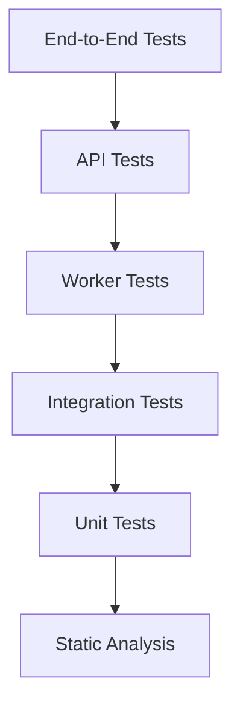

# Sentinel — Testing Strategy

## Document Information

| Field | Value |
|---|---|
| Version | v0.2 |
| Status | Draft |
| Owner | Siddhu |
| Audience | Engineers building and reviewing Sentinel; future maintainers |
| Dependencies | `01-Product-Requirements.md`, `02-Domain-Model.md`, `03-Architecture.md` |
| Revision History | v0.1 — initial draft, 2026-07-12 |

A note on scope: this document was requested against a set of ten prerequisite documents (`00` through `10`) and an `openapi.yaml`, of which only three actually exist — the PRD, Domain Model, and Architecture doc. Everything below is grounded in those three. Where the requested structure assumes specifics that live in a not-yet-written document (a concrete database schema, a finalized API surface, a dedicated security or observability architecture), this document states the *strategy* that will apply and names what it's waiting on, rather than inventing the missing specifics to fill the gap.

## 1. Purpose

Testing is treated here as an architectural concern, not a phase that happens after architecture is done.

**Why it's architectural:** the layering in `03-Architecture.md` — a Domain layer with zero I/O, dependency inversion so Infrastructure implements interfaces Domain defines — exists partly *because* it makes the system testable at low cost. A testing strategy that ignores this and tests everything through a live database discards the actual payoff of that design. Testability is a property the architecture either provides or doesn't; it can't be bolted on afterward without changing the architecture itself.

**Why it protects long-term maintainability:** every invariant in the Domain Model and every failure scenario in the Architecture doc is a promise about how Sentinel behaves. A promise with no test behind it survives exactly until someone changes code without knowing the promise existed. Tests are how these decisions stay true under people — including a future version of the person who made them — who no longer remember why.

**Why it's an investment, not a cost:** Sentinel's entire premise is producing a trustworthy verdict about untrusted content. A wrong answer here isn't a cosmetic bug — it's the product failing at the one job stated in the PRD's vision. The cost of *not* testing rigorously is a platform nobody can rely on, which is a complete loss of the thing being built, not a quality shortfall on the side.

## 2. Testing Philosophy

Each principle exists for a specific reason, not by convention.

- **Test behavior, not implementation.** The layering exists to make implementation details (which ORM, which queue library) replaceable (Architecture, principle 1). Tests coupled to implementation defeat that on purpose the moment a refactor that changed nothing observable breaks the suite.
- **Deterministic tests.** A flaky test that's "probably fine" trains everyone to distrust red builds, which is worse than having no test — a suite people don't believe stops catching anything.
- **Fast feedback.** The Domain layer having zero I/O (Architecture Section 4) means Domain tests should run in milliseconds. A strategy that routes every test through Postgres throws that design decision away.
- **Independent tests.** Order-dependent tests hide bugs — a test that only passes because an earlier test left state behind — and block parallelizing the suite as it grows.
- **Repeatable execution.** Same result on any machine, any time. A test that passes locally and fails in CI, or the reverse, is a false signal, not a useful one.
- **Single responsibility per test.** A failing test should say roughly what's broken from its name alone. A test asserting five unrelated things makes every failure expensive to diagnose.
- **Tests as documentation.** A test named around "idempotent re-analysis returns the existing result" is a readable restatement of Domain Model invariant 6. A new engineer can learn the system's actual guarantees from the test suite faster than from prose.
- **Regression prevention.** A bug fixed without a test protecting it is a bug that will return, usually at a worse time than the first one.
- **Confidence over coverage percentage.** A percentage measures which lines executed, not whether anything meaningful was asserted. It's a tool for finding untested code, not a target to optimize for its own sake — this document deliberately avoids assigning arbitrary coverage numbers later for exactly this reason.
- **Risk-based testing.** Not all code deserves equal investment. The hash-uniqueness invariant is a correctness *and* security guarantee; it deserves more rigor than a formatting script. Effort should track the consequence of being wrong.

## 3. Testing Pyramid

Read top to bottom: fewest and slowest at the top, most numerous and fastest at the bottom. The shape matters — a suite with mostly end-to-end tests and few unit tests (the "ice cream cone" anti-pattern) is slow, flaky, and expensive to diagnose, because a single behavioral bug shows up as a failure five layers away from its cause.

| Layer | Purpose | Runs against |
|---|---|---|
| Static analysis | Catch a class of bugs before any test executes | Source only, no running system |
| Unit | Verify Domain rules and Application orchestration in isolation | In-memory, mocked Infrastructure |
| Integration | Verify Infrastructure adapters actually satisfy the interfaces Domain expects | Real Postgres, real object storage (containerized) |
| API | Verify the HTTP contract from the outside | A running API instance, black-box |
| Worker | Verify queue claim, retry, timeout, and recovery behavior | A running worker against real Postgres |
| End-to-end | Verify complete user-facing flows | The full system, all components live |

Security and performance testing are cross-cutting — they apply at multiple layers rather than owning one (Sections 9 and 10).

## 4. Unit Testing

**Scope:** Domain entities, value objects, Application services, utilities, validation logic, error handling, boundary conditions.

**What's verified here specifically:** every invariant listed in `02-Domain-Model.md`'s "Invariants — consolidated" section should have a corresponding, directly-traceable unit test — not as a nice-to-have, but because an invariant with no test is a documented intention, not an enforced one. Boundary conditions worth explicit coverage: a zero-byte upload, a file at exactly the size limit and one byte over it, an analyzer version string that doesn't parse, a duplicate analysis request arriving before the first one has completed.

**Mocking philosophy:** mock at the Infrastructure interface boundary only — the repository interfaces and adapter contracts the Domain and Application layers define (Architecture Section 4). Never mock a Domain object itself; Domain has no I/O to mock away, and needing to do so is a sign the layering is leaking, not a testing gap to patch over.

**Coverage expectations:** stated as tiers, not percentages, consistent with Section 2's "confidence over coverage percentage" principle — a specific number here would be exactly the kind of target this document argues against. The Domain layer, being pure logic with no legitimate reason for an untested branch, is held to near-total coverage. The Application layer is held to high coverage on orchestration logic, with thin pass-through code explicitly excluded from the expectation rather than padded with low-value tests. Below that, coverage is opportunistic and risk-driven.

## 5. Integration Testing

Integration tests exist because a passing unit test with a mocked repository proves the Application layer *calls* the interface correctly — it proves nothing about whether the real Postgres-backed implementation actually behaves the way the interface promises. That gap is what this layer closes.

- **Database integration:** run against a real, containerized Postgres instance. Verifies migrations apply cleanly and that constraints reject what they're supposed to — the `sha256_hash` `UNIQUE` constraint actually rejecting a duplicate insert is an integration test, not a unit test, because a mock would happily accept it.
- **Repository integration:** each Infrastructure implementation of a Domain-defined repository interface, tested against the real database, proving the contract genuinely holds rather than assumed to hold because the interface compiles.
- **Object Storage:** run against a real S3-compatible endpoint (MinIO in CI, matching the dev/prod parity established in Architecture Section 6.5) — verifying streamed writes, reads, and the failure path when storage is unreachable.
- **Queue:** the Postgres `FOR UPDATE SKIP LOCKED` claim logic, tested under genuine concurrent access — multiple simulated workers polling simultaneously, verifying no job is claimed twice. This is one of the highest-value integration tests in the whole suite; concurrency correctness is exactly the kind of thing that's very hard to verify by reading code and very easy to get subtly wrong.
- **Workers:** the full claim → execute → persist cycle against real Postgres and real object storage.
- **AI provider adapters:** no such adapter exists in Phase 1 — the reference analyzer is a hash/file-type/static-property analyzer with no external AI/LLM dependency. This entry defines the standard for *when* Phase 2 introduces an NLP-driven analyzer: any AI provider adapter must be integration-tested against a real (or realistically simulated) provider endpoint, with explicit tests for provider timeout, malformed provider responses, and provider unavailability — the same failure-mode discipline already applied to object storage and the database.
- **Authentication:** JWT verification against real tokens, including expired tokens and tampered signatures, not just the happy path.
- **Configuration:** environment-based configuration actually loads correctly across environments, rather than assuming it does because it works locally.

## 6. API Testing

Exercises the system exclusively through HTTP, treating the implementation as a black box — this is what actually verifies the *contract*, as opposed to integration tests verifying internal components.

- **REST contract validation & OpenAPI compliance:** FastAPI generates the OpenAPI schema from the same Pydantic models that validate requests (Architecture Section 6.1) — API tests verify actual responses match that generated schema, not just that a response arrived. Once `05-API-Specification.md` and `backend/openapi.yaml` exist, this becomes a direct diff against the published contract rather than an internally-generated one.
- **Authentication & Authorization:** authentication tests confirm *who* is making the request is verified; authorization tests confirm that an authenticated user can be correctly denied access to another user's resources — these are distinct failure modes and need distinct tests, not one test standing in for both.
- **Validation:** malformed, missing, and boundary-value inputs are rejected with the right status code, not a 500.
- **Error responses:** consistent shape and status code across endpoints — an inconsistent error contract is as much a broken contract as a wrong success response.
- **Pagination & Filtering:** not yet finalized in a database or API design document, but any list-returning endpoint (assets, analyses, reports per user) will need both; this strategy anticipates testing them once `05-API-Specification.md` defines the mechanism.
- **Idempotency:** directly verifies Domain Model invariant 6 — requesting analysis twice with the same asset, analyzer, and version returns the same result rather than duplicating work, tested at the HTTP layer, not just the Domain layer, since the guarantee has to hold end-to-end to mean anything to a client.
- **Rate limiting:** not yet a confirmed control, but a reasonable one for a service accepting file uploads from authenticated users; flagged here as a control this strategy expects to test once it's decided, rather than assumed to exist.
- **Version compatibility:** whatever versioning scheme `05-API-Specification.md` settles on, tests should confirm it doesn't silently break an existing client on a new deploy.

## 7. Worker Testing

The queue is the one place in this system where "at least once, safely repeatable" (Architecture, principle 3 lineage — Section 6.7) is the actual guarantee, not "exactly once." Worker tests exist to prove that guarantee holds under conditions that are hard to produce accidentally in normal development.

- **Queue processing:** correctness of the claim mechanism itself, under concurrency.
- **Retry logic:** a transient analyzer failure (e.g., a momentary storage read error) results in a retry, not a permanent failure.
- **Failure handling:** a permanent failure (e.g., an unparseable or corrupt asset) terminates cleanly as `failed`, without retrying indefinitely against a job that will never succeed.
- **Timeouts:** an analyzer that hangs doesn't hold a worker hostage forever — directly tests the stuck-`running`-row scenario named in Architecture Section 9.
- **Cancellation:** not yet a confirmed capability; flagged as a gap worth a product decision rather than silently assumed.
- **Parallel execution:** multiple workers processing distinct jobs concurrently without interfering with each other's state.
- **Recovery:** the periodic sweep that reclaims stale `running` jobs (Architecture Section 9) needs its own test proving it actually reclaims them — documented recovery behavior that's never been exercised isn't verified, it's hoped for.

## 8. End-to-End Testing

Deliberately the smallest, most curated layer (Section 3) — each end-to-end test is expensive, so each one earns its place by covering a complete, PRD-anchored use case rather than a variation of one already covered.

- **Complete upload pipeline:** streamed upload through to a persisted, deduplicated Digital Asset (PRD use case 1).
- **Analysis pipeline:** request through to a completed Analysis, including the queued/worker path (PRD use case 2).
- **Report generation:** one or more Analyses through to a rendered Report (PRD use case 3).
- **History retrieval:** a user retrieving their own prior uploads and analyses — a direct consequence of the Domain Model's User-owns-Upload relationship, not a new feature being introduced here.
- **Authentication:** a full login-to-authenticated-request flow, not just token verification in isolation.
- **Multi-user scenarios:** two distinct users, verifying one cannot see or act on the other's assets — worth testing explicitly even without an `Organization` entity, since per-user isolation is still a real guarantee the PRD implies and the Domain Model's `User`-scoped ownership should enforce.
- **Failure scenarios:** the scenarios catalogued in Architecture Section 9 (storage unreachable mid-upload, worker crash mid-analysis, concurrent duplicate uploads) exercised against the real, running system — not re-verified at the unit level, but actually triggered end-to-end to confirm the system behaves the way the architecture document claims it will.

## 9. Security Testing

- **Authentication testing:** forged tokens, expired tokens, and tampered signatures are all rejected — not just missing tokens.
- **Authorization testing:** every authenticated action is checked against "is this user allowed to do this to this resource," not only "is this user logged in."
- **Input validation:** malformed requests, oversized payloads, and injection-style inputs are rejected at the boundary, not deep in application logic.
- **File validation:** specific to Sentinel's domain — uploaded content is inherently untrusted (Architecture Section 11). Testing includes adversarial files: mismatched extension versus actual content, decompression-bomb-style resource exhaustion, and files deliberately malformed to crash a parser rather than fail cleanly.
- **Dependency scanning:** automated, CI-integrated scanning of third-party packages for known vulnerabilities.
- **Secret detection:** automated scanning for accidentally committed credentials, backing the `.gitignore` exclusion of `.env` already in place in the repository.
- **Abuse scenarios:** upload flooding and analysis-request flooding — resource exhaustion attempted through requests that are individually legitimate.
- **Prompt injection testing:** no target exists for this in Phase 1 — there is no AI/LLM provider integration in the current architecture. This entry defines the standard for when Phase 2 introduces an NLP-driven analyzer: content extracted from an analyzed asset must be treated as untrusted, adversarial input to any AI/LLM provider it's passed to, exactly as file content itself is already treated as untrusted end-to-end (Architecture Section 11) — the same trust boundary, applied one hop further once that hop exists.

## 10. Performance Testing

- **Latency:** measured as p50/p95/p99, not an average — an average hides the tail, and the tail is what users actually notice.
- **Load testing:** behavior under expected concurrent usage.
- **Stress testing:** behavior beyond expected load, to find where the system actually breaks rather than assuming it doesn't.
- **Soak testing:** sustained load over an extended period — catches slow degradation (memory growth, connection pool exhaustion) that short tests never run long enough to see.
- **Scalability testing:** verifies the horizontal-scaling claims in Architecture Section 10 empirically — does adding a second worker instance measurably increase throughput, does it stay close to linear or fall off.
- **Queue throughput:** specifically measures the Postgres-as-queue claim rate under concurrent workers. This is the direct, concrete way to evaluate the upgrade trigger named in Architecture Section 6.7 — the decision to move to a dedicated broker should be made from this measurement, not intuition.
- **Database performance:** query performance on the indexes backing the invariants — hash lookups and the idempotency-check query in particular, since both sit on the hot path of every upload and every analysis request.
- **AI provider latency:** not applicable in Phase 1 for the same reason noted in Sections 5 and 9 — no provider exists yet. Flagged here so the strategy doesn't need to be redesigned when one is introduced; provider latency will need to be measured and budgeted for separately from the rest of the analysis pipeline once it exists, since it's an external dependency the rest of this document's performance model doesn't currently account for.

## 11. Test Data Management

- **Fixtures & Factories:** constructing valid Domain entities for tests through a single, shared factory path rather than repeating construction logic across the suite — when a required field is added to an entity, one factory needs updating, not every test file.
- **Synthetic data:** all file content used in upload and analysis tests is generated, never sourced from anything resembling real user data.
- **Isolation:** no test's data is visible to or dependent on another test's — a consequence of the independence principle in Section 2, enforced concretely through per-test database transactions or equivalent isolation.
- **Cleanup:** test databases and test object storage buckets are reset between runs, not accumulated indefinitely.
- **Repeatability:** the same fixture produces the same test conditions on every run, on every machine.
- **Large files:** streaming upload is a first-class PRD concern, so large synthetic files are a required, not optional, part of the fixture set — a test suite that only ever uploads small files never actually exercises streaming.
- **Sensitive data policy:** real uploaded user content is never used in tests, anonymized or otherwise. Sentinel's entire domain is potentially-sensitive files; synthetic data is the only acceptable input, without exception.

## 12. Test Environments

- **Development:** local, optimized for fast iteration; may substitute lighter-weight equivalents for external services (MinIO for object storage) — the same substitution the architecture already relies on for dev/prod parity (Architecture Section 6.5).
- **CI:** every pull request, full unit and integration suite against real containerized Postgres and MinIO — not mocked, for the reasons given in Section 5.
- **Staging:** planned, not yet provisioned — a production-like environment for pre-release validation, to be established alongside `09-Deployment-Architecture.md`.
- **Production validation:** smoke tests only, run after deployment — confirming the deployed system responds correctly, not re-running the full test suite against production.
- **Environment parity:** the S3-compatible API decision (Architecture Section 6.5) is what makes dev/CI/staging/production parity achievable without environment-specific code branches — this is a testing benefit as much as an architectural one.
- **Configuration isolation:** test environments never hold production credentials or production data, under any circumstance.

## 13. Continuous Validation

- **Pre-commit:** formatting and linting, run locally before a commit exists — the cheapest possible feedback loop, catching what doesn't need a CI run to find.
- **Pull request validation:** the full unit, integration, and API suite plus static analysis and security scans, required to pass before merge (Section 14).
- **CI pipeline ordering:** static analysis first, then unit, then integration, then API and worker tests — cheapest and fastest checks run first, so a broken build fails in seconds rather than after a slow integration run. End-to-end tests run on a slower cadence given their cost (Section 3), not on every commit.
- **Release validation:** a broader pass before a release, including end-to-end and performance smoke checks not run on every PR.
- **Deployment verification:** automated post-deploy smoke tests confirming the newly deployed version is actually healthy before it's considered live.
- **Rollback verification:** a rollback path that has never been exercised is not a real safety net — it's periodically tested on its own, not assumed to work because it hasn't been needed yet.

## 14. Quality Gates

Mandatory before merge:

- **Formatting** — automated, zero human debate.
- **Typing** — enforced; the entire value of Pydantic-typed contracts (Architecture Section 6.1) is undermined if the rest of the codebase isn't held to the same standard.
- **Static analysis** — linting for known bug patterns.
- **Tests passing** — all layers relevant to the change.
- **Coverage** — treated as a floor and a regression signal (a meaningful drop on touched code blocks merge), not an absolute target, consistent with Section 2.
- **Security scans** — dependency and secret scanning, automated.
- **Documentation** — a change that alters a documented invariant or API contract updates the relevant doc in the same PR. This project has treated documentation as a first-class artifact since Sprint 0; this gate is what keeps that true under pressure, not just at the start.
- **OpenAPI consistency** — not yet active, pending `05-API-Specification.md` and `backend/openapi.yaml`; once they exist, generated schema drift from the published contract blocks merge.

## 15. Test Governance

- **Ownership:** whoever owns a piece of code owns its tests — there is no separate QA function siloed from engineering in this project's scale or structure (Architecture Section 6.3).
- **Review expectations:** tests are reviewed with the same rigor as production code. A weak test that passes without meaningfully asserting anything is a liability, not a freebie.
- **Flaky test policy:** a test observed failing intermittently, with no corresponding code change, is quarantined — excluded from the required gate — within one business day, tagged with an owner and a fix-or-remove deadline. Quarantine is a bounded state, not a place tests go to be forgotten.
- **Failure triage:** a failing test on the main branch is treated as an incident for that branch — stopped and fixed, not accumulated alongside other red tests.
- **Test maintenance:** tests are refactored alongside the code they test; a test file that's the only thing in a module never touched during a refactor is a sign it's stopped verifying anything real.
- **Deprecation policy:** when a feature is removed, its tests are removed with it in the same change — not left behind asserting the absence of something nobody's checking for.

### Additional Production Practices

- **Test Impact Analysis (TIA):** Large suites may selectively execute affected tests for developer feedback, while full validation still runs before merge.
- **Test sharding:** CI may shard long-running suites across multiple executors provided determinism is preserved.

## 16. Future Evolution

- **Property-based testing:** generating many inputs against an invariant instead of hand-picking examples — a strong fit for Domain Model invariants like hash uniqueness and idempotent re-analysis, which are universal properties rather than case-specific behaviors.
- **Mutation testing:** deliberately introducing small bugs and confirming the suite catches them — tests the tests, directly addressing the "high coverage, weak assertions" failure mode named in Section 2.
- **Chaos engineering:** injecting the failure scenarios from Architecture Section 9 into a running staging environment rather than only testing them in isolation — verifying the system's actual resilience, not each component's resilience considered separately.
- **Contract testing / consumer-driven contracts:** relevant once a real frontend and, per PRD Phase 2, potential third-party analyzer integrators depend on the API surface — verifying changes don't silently break a consumer.
- **AI-assisted testing:** tooling to help generate or maintain tests, adopted as it proves useful rather than assumed valuable in advance.
- **Continuous verification:** moving some verification into production itself — synthetic monitoring, canary analysis — which starts to blur testing into observability, and should stay consistent with `10-Observability-Architecture.md` once that document exists.

## 17. Testing Decision Records

| Decision | Reasoning |
|---|---|
| Integration tests run against real, containerized Postgres and MinIO, never mocks | Verifies actual constraint and adapter behavior (Section 5), not assumed behavior |
| Domain layer tests require zero I/O | Enforces the layering in Architecture Section 4; a Domain test needing a database is a layering violation, not a testing gap |
| Coverage is a floor and regression signal, not a target | Section 2 — confidence over percentage |
| Flaky tests are quarantined on a bounded deadline, never left permanently red | Protects trust in the suite (Section 2 — deterministic tests) |
| AI-provider testing standards are defined now, activated at Phase 2 | Avoids redesigning this strategy later, and avoids asserting an integration that doesn't currently exist |
| The end-to-end suite stays small and deliberately curated | Section 3 — E2E is the most expensive, slowest layer; breadth belongs lower down |

## Appendix

**Testing pyramid (recap):** Static analysis -> Unit -> Integration -> API -> Worker -> End-to-end, fastest/cheapest/most-numerous at the base, slowest/most-expensive/highest-confidence at the top (Section 3).

**Test taxonomy — quick reference**

| Layer | Tests | Speed | Where it runs |
|---|---|---|---|
| Static analysis | Types, lint rules | Seconds | Local, pre-commit, CI |
| Unit | Domain rules, Application orchestration | Milliseconds each | Local, CI, every PR |
| Integration | Infrastructure adapters | Seconds each | CI, containerized dependencies |
| API | HTTP contract | Seconds each | CI, running API instance |
| Worker | Queue/retry/timeout/recovery behavior | Seconds each | CI, running worker + Postgres |
| End-to-end | Full user-facing flows | Minutes | CI (slower cadence), pre-release |

**Quality gate checklist (Section 14 condensed):** formatting - typing - static analysis - tests passing - coverage regression check - security scans - documentation updated - OpenAPI consistency (once active).

**Review checklist for new tests:**
- Does the test name describe the behavior being verified, not the implementation?
- Does it assert something that would actually fail if the behavior broke?
- Is it independent of test execution order?
- Does it belong at this layer, or does a cheaper layer already cover it?
- If it references an invariant or failure scenario, is that traceable back to the Domain Model or Architecture doc?

## 18. Release Validation Matrix

Every production release must satisfy:

✓ Static analysis passed

✓ Unit tests passed

✓ Integration tests passed

✓ API contract validation passed

✓ Worker tests passed

✓ End-to-end validation completed

✓ Security scans passed

✓ Performance regression check completed

✓ Documentation synchronized

✓ OpenAPI contract unchanged or intentionally versioned

✓ Rollback verification completed

## 19. Requirements Traceability

Every major business capability defined in the PRD must be traceable to one or more tests.

Every architectural invariant defined in the Domain Model and Architecture documents must have corresponding automated verification.

A production defect should result in a regression test before the defect is considered resolved.

This policy ensures that documentation, implementation, and testing evolve together rather than independently.
