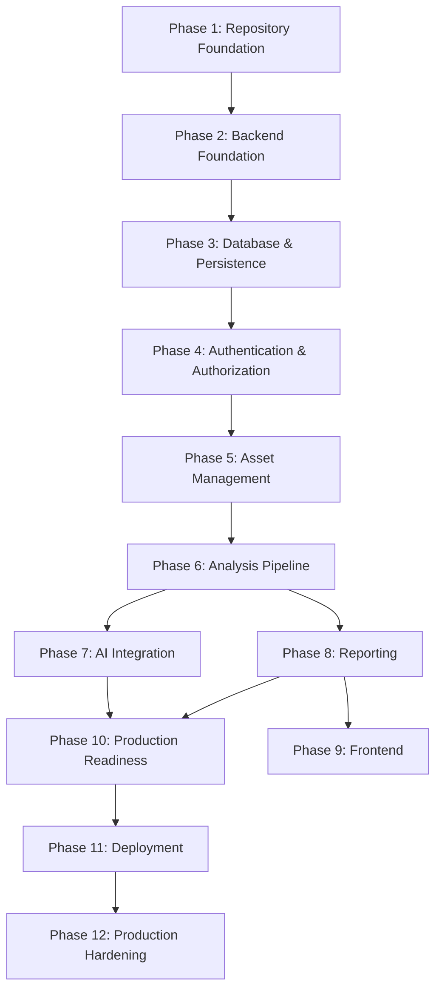

# Sentinel — Implementation Roadmap

## Document Information

| Field | Value |
|---|---|
| Document | docs/21-Implementation-Roadmap.md |
| Version | 1.0.1 |
| Status | Final |
| Owner | Engineering Director |
| Audience | Principal engineers, engineering managers, TPMs, staff engineers, platform teams |
| Dependencies | All approved documents (00–20), backend/openapi.yaml |

---

## 1. Purpose

The architecture is approved. Documents 00 through 20 and backend/openapi.yaml define what Sentinel is, how it works, how it is tested, deployed, observed, secured, governed, and maintained. None of those decisions are revisited here.

This document answers a different question: **in what order does the engineering team build it, and how do they know when each piece is done?**

### 1.1 Architecture Freeze

The documentation baseline (Documents 00–20 and backend/openapi.yaml) is frozen. Implementation must conform to the approved architecture. Any proposed change to architectural decisions, domain model invariants, API contracts, security controls, or deployment topology requires:

1. An **RFC** (18-RFC-Process) to propose and evaluate the change
2. An **ADR** (17-Architecture-Decision-Records-Guide) to record the decision
3. **Architecture Owner approval** (16-Engineering-Governance §7)

Implementation may not introduce undocumented features, undocumented endpoints, undocumented entities, or undocumented infrastructure components. If something is not in Documents 00–20, it is not in scope.

### 1.2 How to Read This Document

- **Phases** are ordered by dependency, not by calendar time. Phase N+1 cannot begin until Phase N's exit criteria are met.
- **Deliverables** are concrete, verifiable outputs — code, configuration, passing tests — not plans or documents.
- **Acceptance Criteria** define what "working" means. **Definition of Done** defines what "shippable" means. These are different things.
- **Estimated Relative Complexity** uses T-shirt sizes (S/M/L/XL) to communicate effort without false precision.

### 1.2.1 Definition of Ready

Before work begins on any phase, the phase must satisfy a Definition of Ready: all prerequisite phases are complete, architectural dependencies are available, required documentation is approved, implementation tasks are understood, and no required ADR or RFC remains pending.

### 1.3 Phase Exit Protocol

Every phase ends with a mandatory **Architecture Compliance Review** before the next phase may begin. This prevents implementation drift — the gradual accumulation of small deviations that individually seem harmless but collectively corrupt the architecture.

The exit sequence for every phase is:

```
Phase N deliverables complete
       ↓
Exit Criteria met
       ↓
Architecture Compliance Review
  • Layer dependency rules honored (no upward imports)
  • API responses match openapi.yaml schemas
  • Domain invariants preserved (02-Domain-Model)
  • No undocumented endpoints, entities, or infrastructure
  • Test coverage meets phase-specific expectations
  • Documentation updated to reflect implementation
  • Security controls implemented as specified
       ↓
Review passes → Proceed to Phase N+1
Review fails  → Fix violations → Re-review
```

Architecture Compliance Reviews are not optional and are not waivable by schedule pressure. A phase that ships code violating the approved architecture has not met its exit criteria, regardless of whether the code "works."

---

## 2. Engineering Principles

Every implementation decision must preserve the following properties, derived from the approved architecture. When two principles conflict, they are resolved in the priority order listed (03-Architecture §2.4).

| Priority | Principle | Source | Implementation Constraint |
|---|---|---|---|
| 1 | Correctness | 03-Architecture §2.4 | A wrong verdict is worse than no verdict. Every code path must be provably correct before it is considered complete. |
| 2 | Maintainability | 03-Architecture §2.2, §5 | A single developer must reason about the entire system. No abstraction that exceeds one person's working memory. |
| 3 | Observability | 10-Observability-Architecture | Every component emits structured logs, metrics, and traces from day one, not retrofitted later. |
| 4 | Security | 08-Security-Architecture | Defense in depth at every layer. Secure by default. Fail closed. |
| 5 | Reliability | 15-Disaster-Recovery | Submitted assets are never lost. Completed analyses are durable. |
| 6 | Performance | 14-Performance-and-Scalability | Analysis is async by design. Correctness is never sacrificed for speed. |
| 7 | Testability | 11-Testing-Strategy | Every component must be independently testable. Tests verify behavior, not implementation. |
| 8 | Governance | 16-Engineering-Governance | Architecture compliance is verified at code review. Documentation updates ship with the code they describe. |

---

## 3. Project Phases

### Phase 1: Repository Foundation

**Purpose:** Establish the physical project structure that mirrors the architectural layers defined in 06-Repository-Structure, with tooling, linting, formatting, dependency management, and CI pipeline skeleton. Nothing can be built until the house has a foundation.

**Dependencies:** None (first phase).

**Deliverables:**
- Backend directory structure matching 06-Repository-Structure §2–§3 exactly
- `pyproject.toml` with pinned dependencies (FastAPI, SQLAlchemy, Alembic, Celery, Pydantic, pytest, httpx)
- `.env.example` with all environment variables documented per 07-Backend-Development-Standards §11
- `docker-compose.yml` for local development (PostgreSQL, Redis, MinIO) per 09-Deployment-Architecture
- Dockerfile(s) per 09-Deployment-Architecture §4
- Pre-commit hooks: ruff (linting + formatting), mypy (type checking) per 07-Backend-Development-Standards §12
- GitHub Actions CI skeleton: lint → type-check → test (empty suite passes) per 12-CI-CD-Architecture §3
- `README.md` updated to link to docs/00-Project-Context per 06-Repository-Structure §2
- `.github/` with PR template and issue templates per 19-Contributor-Guide

**Acceptance Criteria:**
- `docker compose up` starts PostgreSQL, Redis, MinIO with health checks passing
- `ruff check .` and `mypy .` pass with zero errors on the empty codebase
- CI pipeline runs to green on an empty commit
- Directory structure matches 06-Repository-Structure §3 exactly (automated check)

**Definition of Done:**
- All deliverables merged to `main`
- CI pipeline green
- A second engineer can clone, run `docker compose up`, and have a working local environment within 5 minutes with no verbal instructions

**Risks:**
- Dependency version conflicts between FastAPI, SQLAlchemy, and Pydantic
- Docker Compose networking issues across OS variants (Windows, macOS, Linux)

**Exit Criteria:** CI green, local dev environment reproducible, PR template enforced.

**Estimated Relative Complexity:** S

---

### Phase 2: Backend Foundation

**Purpose:** Implement the FastAPI application factory, configuration management, dependency injection container, and the layered module structure that enforces the Presentation → Application → Domain → Infrastructure dependency rules.

**Dependencies:** Phase 1 (repository structure, Docker environment).

**Deliverables:**
- FastAPI application factory (`app/main.py`) with startup/shutdown lifecycle hooks per 07-Backend-Development-Standards §3
- Settings management via Pydantic `BaseSettings` per 07-Backend-Development-Standards §11
- Dependency injection wiring per 06-Repository-Structure §14 (dependency inversion)
- Global exception handlers producing RFC 7807 error responses per 05-API-Specification error schema
- Request ID middleware (`X-Request-ID` propagation) per 08-Security-Architecture §7, 10-Observability-Architecture §2
- CORS middleware per 08-Security-Architecture §7
- Structured logging setup (JSON, correlation IDs) per 07-Backend-Development-Standards §10, 10-Observability-Architecture §2
- Health check endpoint (`GET /health`) per openapi.yaml
- API versioning structure (`/api/v1/`) per 06-Repository-Structure §4
- Base Pydantic schemas: pagination, error responses, standard envelopes per 05-API-Specification
- Rate limiting middleware (429 + `Retry-After`) per 08-Security-Architecture §7

**Acceptance Criteria:**
- `GET /health` returns 200 with structured response
- `X-Request-ID` is generated and propagated in request/response
- Invalid routes return RFC 7807 error format
- Structured JSON logs include correlation ID, timestamp, level
- Rate limiter returns 429 with `Retry-After` header when threshold exceeded

**Definition of Done:**
- All deliverables merged, CI green
- Unit tests for exception handlers, middleware, settings loading
- API test for health endpoint validating response schema against openapi.yaml
- Code review confirms no business logic in Presentation layer

**Risks:**
- Middleware ordering conflicts (CORS, auth, rate limiting, request ID)
- Settings validation failures across environments

**Exit Criteria:** Health endpoint live, structured logging operational, middleware stack validated.

**Estimated Relative Complexity:** M

---

### Phase 3: Database & Persistence

**Purpose:** Implement the database schema defined in 04-Database-Design, the Alembic migration framework, ORM models, and the repository pattern (abstract interfaces in Domain, concrete implementations in Infrastructure).

**Dependencies:** Phase 2 (application factory, settings, DI container).

**Deliverables:**
- SQLAlchemy ORM models for all entities per 04-Database-Design: `users`, `uploads`, `digital_assets`, `analyses`, `reports`, `report_analyses`, `audit_logs`, `user_refresh_tokens` per §3–§8
- All constraints, indexes, and triggers per 04-Database-Design §3–§8
- Alembic configuration and initial migration per 06-Repository-Structure §3
- Abstract repository interfaces in `app/domain/repositories/` per 06-Repository-Structure §7
- Concrete PostgreSQL repository implementations in `app/infrastructure/database/` per 06-Repository-Structure §8
- Database session management (async sessions, connection pooling) per 07-Backend-Development-Standards §7
- Soft-delete query filters (`WHERE deleted_at IS NULL`) per 04-Database-Design §9, §10
- Database health check integration per 09-Deployment-Architecture

**Acceptance Criteria:**
- `alembic upgrade head` creates all tables matching 04-Database-Design exactly
- `alembic downgrade base` cleanly reverses all migrations
- `sha256_hash` UNIQUE constraint rejects duplicate inserts (integration test)
- Soft-delete filter excludes deleted records from all standard queries
- All abstract repository interfaces have corresponding concrete implementations
- Connection pool handles concurrent requests without deadlocks

**Definition of Done:**
- Migrations merged, CI runs `alembic upgrade head` → test suite → `alembic downgrade base` as part of pipeline
- Integration tests run against containerized PostgreSQL (not mocks)
- Every constraint in 04-Database-Design has a corresponding test proving it rejects invalid data
- No ORM model imported in `app/domain/` (dependency direction verified)

**Risks:**
- Migration ordering conflicts when multiple developers work simultaneously
- Performance of `FOR UPDATE SKIP LOCKED` job claiming under concurrent load
- Alembic autogenerate missing manual constraints (triggers, partial indexes)

**Exit Criteria:** All tables created, all constraints enforced, repository pattern operational.

**Estimated Relative Complexity:** L

---

### Phase 4: Authentication & Authorization

**Purpose:** Implement JWT-based authentication, role-based access control (admin, analyst, viewer), and user management endpoints — the security perimeter through which all subsequent features are accessed.

**Dependencies:** Phase 3 (users table, repository pattern).

**Deliverables:**
- User registration (`POST /auth/register`) per openapi.yaml
- User login with JWT access/refresh token pair (`POST /auth/login`) per openapi.yaml, 08-Security-Architecture §4
- Token refresh (`POST /auth/refresh`) with refresh token rotation per 08-Security-Architecture §4
- Logout with token revocation (`POST /auth/logout`) per openapi.yaml
- Current user endpoint (`GET /auth/me`) per openapi.yaml
- Password hashing with adaptive algorithm (bcrypt/argon2) per 08-Security-Architecture §4
- JWT validation middleware per 08-Security-Architecture §4
- Role-based authorization decorator/dependency per 08-Security-Architecture §5
- User CRUD endpoints (`GET /users`, `GET /users/{userId}`, `PATCH /users/{userId}`, `DELETE /users/{userId}`) per openapi.yaml — admin-only where specified
- Audit logging for all auth events per 08-Security-Architecture §10
- Domain entities: User entity with invariants per 02-Domain-Model
- Application services: AuthService, UserService per 06-Repository-Structure §6

**Acceptance Criteria:**
- Registration creates user, returns user object (no password in response)
- Login returns access + refresh token pair; access token expires per `expiresIn`
- Expired access token returns 401; valid refresh token issues new pair
- Refresh token rotation: old refresh token invalidated after use
- Viewer cannot access admin endpoints (403)
- Analyst cannot modify other users (403)
- Admin can list, view, update, deactivate users
- All auth events produce audit log entries
- Passwords are never logged, never returned in API responses

**Definition of Done:**
- All auth endpoints match openapi.yaml response schemas exactly
- Unit tests for Domain entities (User invariants per 02-Domain-Model)
- Unit tests for Application services (AuthService orchestration)
- Integration tests for JWT verification (valid, expired, tampered tokens)
- API tests for every auth endpoint (happy path + error paths)
- Security review: no credential leakage in logs, responses, or error messages

**Risks:**
- JWT secret management across environments
- Refresh token storage and revocation at scale
- Timing attacks on password comparison

**Exit Criteria:** All auth endpoints functional, RBAC enforced, audit trail operational.

**Estimated Relative Complexity:** L

---

### Phase 5: Asset Management

**Purpose:** Implement the complete upload pipeline and Digital Asset lifecycle — the core content ingestion path that everything downstream depends on.

**Dependencies:** Phase 4 (authentication — uploads require an authenticated user).

**Deliverables:**
- Object storage adapter (S3-compatible) in `app/infrastructure/storage/` per 06-Repository-Structure §8
- Upload endpoint (`POST /uploads`) with streaming, size validation, MIME allow-list, magic-byte verification per openapi.yaml, 08-Security-Architecture §6
- Upload status endpoint (`GET /uploads/{uploadId}`) per openapi.yaml
- SHA-256 hash computation (server-side, streaming) per 02-Domain-Model invariant 1
- Duplicate detection: hash lookup → existing DigitalAsset resolution per 02-Domain-Model
- Upload list endpoint (`GET /uploads`) per openapi.yaml
- Digital Asset CRUD endpoints (`GET /assets`, `GET /assets/{assetId}`, `DELETE /assets/{assetId}`) per openapi.yaml
- Digital Asset entity in Domain layer (immutable, hash-identity invariant) per 02-Domain-Model
- Upload entity in Domain layer (state machine: pending → processing → completed/failed) per 02-Domain-Model, 04-Database-Design §9.1
- Idempotency-Key support on `POST /uploads` per openapi.yaml assumption 9
- Soft-delete for Digital Assets (90-day retention) per 04-Database-Design §9.2, §9.5
- Abandoned upload cleanup (24-hour threshold) per 04-Database-Design §9.1
- Audit logging for all asset operations per 08-Security-Architecture §10

**Acceptance Criteria:**
- File upload streams to MinIO/S3, SHA-256 computed during streaming (not buffered in memory)
- Duplicate upload resolves to existing DigitalAsset (same hash → same asset)
- Upload of identical content returns the same `assetId` (deduplication verified)
- Files exceeding 100MB are rejected at the streaming boundary
- Files with disallowed MIME types are rejected after magic-byte verification
- Idempotency-Key prevents duplicate Upload records on retry
- Digital Asset records are immutable (no UPDATE endpoint exists)
- Soft-deleted assets excluded from all user-facing queries
- Object storage failures produce structured error responses, not 500s

**Definition of Done:**
- All asset endpoints match openapi.yaml schemas exactly
- Unit tests: Digital Asset immutability invariant, Upload state machine transitions, hash computation
- Integration tests: S3 upload/download, duplicate detection, constraint enforcement
- API tests: upload happy path, duplicate detection, size rejection, MIME rejection, idempotency
- Upload of a 100MB file completes without OOM (streaming verification)

**Risks:**
- Memory pressure from large file uploads if streaming is implemented incorrectly
- Race condition in duplicate detection (two concurrent uploads of same file)
- Object storage connectivity failures during upload (partial writes)

**Exit Criteria:** Files can be uploaded, deduplicated, stored, retrieved, and soft-deleted.

**Estimated Relative Complexity:** XL

---

### Phase 6: Analysis Pipeline

**Purpose:** Implement the asynchronous analysis execution pipeline — queue, workers, job lifecycle, retry logic — the backbone that connects uploaded assets to intelligence results.

**Dependencies:** Phase 5 (Digital Assets must exist before they can be analyzed).

**Deliverables:**
- Queue infrastructure adapter (Redis/Celery or PostgreSQL `FOR UPDATE SKIP LOCKED`) per 03-Architecture §5, 06-Repository-Structure §8
- Analysis Worker (`app/workers/analysis_worker/`) per 06-Repository-Structure §9
- Analysis request endpoint (`POST /assets/{assetId}/analyses`) per openapi.yaml
- Analysis list endpoint (`GET /analyses`, `GET /assets/{assetId}/analyses`) per openapi.yaml
- Analysis detail endpoint (`GET /analyses/{analysisId}`) per openapi.yaml
- Analysis cancel endpoint (`POST /analyses/{analysisId}/cancel`) per openapi.yaml
- Analysis entity in Domain layer (append-only, versioned) per 02-Domain-Model
- Analysis state machine: pending → running → completed/failed/cancelled per 02-Domain-Model, 04-Database-Design §9.3
- Idempotency: same analyzer version + same asset → return existing Analysis per 02-Domain-Model invariant 6
- Retry logic with configurable max retries per 04-Database-Design §9.3
- Worker health monitoring per 10-Observability-Architecture
- Analyzer registry (`app/analyzers/registry/`) per 06-Repository-Structure §10
- Analyzer base interface (`app/analyzers/base/`) per 06-Repository-Structure §10
- Metadata Analyzer (first concrete analyzer) per 02-Domain-Model: extracts file type, size, basic properties
- Analysis result schema: verdict + evidence + confidence + recommendation per openapi.yaml invariant 4

**Acceptance Criteria:**
- Requesting analysis creates a `pending` Analysis record and publishes to queue
- Worker picks up job, transitions to `running`, executes analyzer, transitions to `completed`
- Failed analysis records error message and retries up to max
- Cancelled analysis transitions correctly from pending or running
- Duplicate analysis request (same asset + same analyzer version) returns existing record
- Analysis records are never updated after reaching terminal state (append-only)
- Every analysis result includes verdict, evidence, confidence, recommendation
- Worker failures do not crash the API process (separate failure domains)

**Definition of Done:**
- All analysis endpoints match openapi.yaml schemas
- Unit tests: Analysis entity invariants, state machine transitions, idempotency logic
- Integration tests: queue claim under concurrent workers (`FOR UPDATE SKIP LOCKED`), retry behavior, worker crash recovery
- API tests: request analysis, poll status, retrieve result, cancel
- Worker tests: claim → execute → persist cycle against real PostgreSQL
- Metadata Analyzer produces valid Analysis result schema

**Risks:**
- Job claiming race conditions under concurrent workers
- Worker memory leaks on long-running analysis jobs
- Queue message loss during Redis/PostgreSQL failover
- Analyzer timeout handling (stuck jobs)

**Exit Criteria:** End-to-end analysis pipeline operational: request → queue → worker → analyzer → result.

**Estimated Relative Complexity:** XL

---

### Phase 7: AI Integration

**Purpose:** Implement the AI provider adapter infrastructure and the first AI-powered analyzer (AI Document Analyzer), extending the analysis pipeline from Phase 6 with external AI capabilities.

**Dependencies:** Phase 6 (analysis pipeline must be operational).

**Deliverables:**
- AI provider adapter interface in `app/infrastructure/ai_providers/` per 06-Repository-Structure §8
- First AI provider implementation (OpenAI or equivalent) per 03-Architecture §5
- AI Document Analyzer (`app/analyzers/ai_document_analyzer/`) per 06-Repository-Structure §10
- Prompt construction with strict system/user separation (anti-prompt-injection) per 08-Security-Architecture §8
- AI provider timeout, retry, and fallback handling per 08-Security-Architecture §8
- Output validation: AI response parsed and validated against Analysis result schema
- Cost tracking and rate limiting for AI provider calls
- Security Analyzer (`app/analyzers/security_analyzer/`) — static analysis, hash reputation
- OCR Analyzer (`app/analyzers/ocr_analyzer/`) — text extraction from images/PDFs
- Image Analyzer (`app/analyzers/image_analyzer/`) — image-specific analysis

**Acceptance Criteria:**
- AI Document Analyzer produces structured verdict + evidence + confidence + recommendation
- Prompt injection via embedded document content does not alter system instructions
- AI provider timeout produces `failed` Analysis with descriptive error, not a hang
- Malformed AI provider response produces `failed` Analysis, not a crash
- All analyzers conform to the base analyzer interface
- Each analyzer is independently testable without the full pipeline

**Definition of Done:**
- Integration tests against AI provider (real or realistically simulated) per 11-Testing-Strategy §5
- Explicit tests for: provider timeout, malformed response, rate limit exceeded, prompt injection attempt
- Unit tests for prompt construction and output validation
- API tests confirming AI-analyzed assets produce valid Analysis results
- Security review of prompt construction (no system prompt leakage)

**Risks:**
- AI provider cost overruns from unconstrained analysis requests
- Prompt injection bypassing system/user content separation
- AI provider API changes breaking the adapter
- Latency variability from AI provider affecting user experience

**Exit Criteria:** At least two analyzers (Metadata + one AI-powered) producing valid results through the pipeline.

**Estimated Relative Complexity:** L

---

### Phase 8: Reporting

**Purpose:** Implement Report generation, PDF rendering, and the report management endpoints — the human-facing output layer that synthesizes analysis results.

**Dependencies:** Phase 6 (analyses must exist to be included in reports).

**Deliverables:**
- Report creation endpoint (`POST /analyses/{analysisId}/report`) per openapi.yaml
- Report list endpoint (`GET /reports`) per openapi.yaml
- Report detail endpoint (`GET /reports/{reportId}`) per openapi.yaml
- Report download endpoint (`GET /reports/{reportId}/download`) per openapi.yaml
- Report deletion (soft-delete) per openapi.yaml
- Report entity in Domain layer (immutable snapshot) per 02-Domain-Model
- Report state machine: draft → rendering → rendered/failed per 04-Database-Design §9.4
- PDF generation worker per 06-Repository-Structure §9
- PDF storage in object storage per 04-Database-Design §9.4
- Report–Analysis linkage validation: all analyses must reference the same Digital Asset per 02-Domain-Model invariant 7
- Soft-delete with 90-day retention per 04-Database-Design §9.5

**Acceptance Criteria:**
- Report generated from one or more analyses of the same asset
- Report generation rejects analyses from different assets (invariant enforced)
- Generated PDF stored in object storage, downloadable via signed URL
- Report records are immutable after generation
- Soft-deleted reports excluded from user-facing queries
- Report download returns proper `Content-Type` and `Content-Disposition` headers

**Definition of Done:**
- All report endpoints match openapi.yaml schemas
- Unit tests: Report entity invariants, cross-asset validation
- Integration tests: PDF generation, object storage write/read
- API tests: create report, download PDF, delete report
- Generated PDF is readable and contains verdict, evidence, confidence, recommendation

**Risks:**
- PDF generation library memory consumption on large reports
- Object storage latency for large PDF downloads
- Concurrent report generation for the same asset

**Exit Criteria:** Reports can be generated, stored, retrieved, downloaded, and deleted.

**Estimated Relative Complexity:** M

---

### Phase 9: Frontend

**Purpose:** Implement the React client application consuming the REST API, providing the user interface for upload, analysis, reporting, and administration.

**Dependencies:** Phase 8 (all backend APIs must be operational).

**Deliverables:**
- React application setup per 06-Repository-Structure §15 (`frontend/`)
- Authentication UI: register, login, logout, session management
- Dashboard: overview of user's assets and recent analyses
- Upload UI: drag-and-drop file upload with progress, size/type validation
- Asset management UI: list, view, delete assets
- Analysis UI: request analysis, view status, view results with verdict/evidence/confidence
- Report UI: generate report, view report, download PDF
- Admin UI: user management (admin role only)
- Audit log viewer (admin role only)
- Responsive layout per 01-Product-Requirements §5 (security-minded developer, batch triage)
- Error handling: structured error display from RFC 7807 responses
- Loading states, empty states, error states for all views

**Acceptance Criteria:**
- All user flows from 01-Product-Requirements §6 (Core Use Cases) are implementable through the UI
- Authentication flow handles token expiry and refresh transparently
- Upload shows real-time progress and handles failures gracefully
- Analysis results display verdict, evidence, confidence, and recommendation
- Admin-only views are inaccessible to non-admin roles
- UI communicates only through the documented REST API (no backend shortcuts)

**Definition of Done:**
- Frontend application builds and serves without errors
- E2E tests covering critical user flows (upload → analyze → report)
- Accessibility baseline (semantic HTML, keyboard navigation, screen reader labels)
- Responsive across desktop and tablet breakpoints
- Code review confirms frontend has no backend-bypass code paths

**Risks:**
- JWT token refresh race conditions in the browser
- Large file upload UX on slow connections
- Frontend framework upgrade conflicts

**Exit Criteria:** All core user flows operational through the UI.

**Estimated Relative Complexity:** XL

---

### Phase 10: Production Readiness

**Purpose:** Implement the observability stack, security hardening, performance testing, and operational tooling required before serving real traffic.

**Dependencies:** Phases 1–8 (all backend features complete).

**Deliverables:**
- Structured logging finalization per 10-Observability-Architecture §3–§4
- Metrics collection (Prometheus-compatible) per 10-Observability-Architecture §5
- Distributed tracing (OpenTelemetry) per 10-Observability-Architecture §6
- Alerting rules per 10-Observability-Architecture §8
- Security hardening checklist per 08-Security-Architecture §12–§14
- Dependency vulnerability scanning per 08-Security-Architecture §12
- Secret scanning per 08-Security-Architecture §12
- Load testing per 14-Performance-and-Scalability-Architecture
- SLO definition and monitoring per 10-Observability-Architecture §7
- Runbook documentation per 20-Operations-Runbook
- Backup and restore procedures per 15-Disaster-Recovery §3–§5
- Data retention enforcement (cleanup jobs) per 04-Database-Design §9.5–§9.6

**Acceptance Criteria:**
- Every API endpoint emits request latency, status code, and error rate metrics
- Every worker job emits duration, outcome, and queue depth metrics
- Correlation ID traces a single request across API → Queue → Worker → Analyzer
- Alerts fire within 5 minutes of SLO breach
- No high or critical vulnerabilities in dependency scan
- System handles 10x expected load without error rate exceeding 1%
- Database backup completes and can be restored to a clean instance

**Definition of Done:**
- Observability stack deployed and verified in staging
- Dashboards for API latency, error rate, queue depth, worker throughput
- Alert rules reviewed and tested with synthetic failure injection
- Load test results documented with baseline metrics
- Security scan report clean (no high/critical findings)
- Backup/restore tested end-to-end

**Risks:**
- Observability overhead impacting application performance
- Alert fatigue from poorly tuned thresholds
- Load test infrastructure costs

**Exit Criteria:** System is observable, secure, and load-tested.

**Estimated Relative Complexity:** L

---

### Phase 11: Deployment

**Purpose:** Implement the production deployment pipeline — container builds, environment promotion, infrastructure-as-code, and zero-downtime deployment — per the approved deployment and CI/CD architecture.

**Dependencies:** Phase 10 (production readiness verified).

**Deliverables:**
- Container image build pipeline per 12-CI-CD-Architecture §3 (build once, deploy many)
- Environment promotion pipeline: Development → Staging → Production per 12-CI-CD-Architecture §5
- Infrastructure-as-Code for all environments per 09-Deployment-Architecture §2
- Database migration pipeline per 12-CI-CD-Architecture §4
- Zero-downtime deployment (rolling update) per 09-Deployment-Architecture §2
- Environment-specific configuration management per 09-Deployment-Architecture §7
- Secrets management per 08-Security-Architecture §11
- Container image scanning per 08-Security-Architecture §12
- Deployment verification (smoke tests post-deploy) per 12-CI-CD-Architecture §6
- Rollback procedure per 13-Release-Engineering §5

**Acceptance Criteria:**
- Same container image promoted through all environments (never rebuilt)
- Deployment to staging requires no manual steps after merge to main
- Production deployment requires explicit approval per 13-Release-Engineering §3
- Zero-downtime verified: no 5xx errors during deployment
- Rollback completes within 5 minutes
- Secrets are never stored in source control, images, or logs

**Definition of Done:**
- Full pipeline operational: commit → build → test → staging → production
- Rollback tested successfully at least once
- Infrastructure can be rebuilt from IaC definitions alone
- Deployment runbook documented per 20-Operations-Runbook

**Risks:**
- Database migration failures during zero-downtime deployment
- Secret rotation during deployment causing transient auth failures
- Infrastructure-as-code state drift between environments

**Exit Criteria:** Production environment live, deployment pipeline operational, rollback verified.

**Estimated Relative Complexity:** L

---

### Phase 12: Production Hardening

**Purpose:** Post-deployment stabilization — monitoring real production traffic, tuning alerts, resolving operational issues, and validating that the system behaves as designed under real-world conditions.

**Dependencies:** Phase 11 (production deployment complete).

**Deliverables:**
- Production traffic monitoring per 10-Observability-Architecture
- Alert threshold tuning based on real traffic patterns
- Performance baseline from production metrics per 14-Performance-and-Scalability
- Incident response procedure validation per 15-Disaster-Recovery §7
- Error budget tracking per 10-Observability-Architecture §7
- On-call rotation setup per 20-Operations-Runbook
- Post-launch security review per 08-Security-Architecture §14
- Documentation audit: verify all 21 documents reflect the implemented system per 16-Engineering-Governance §6.6

**Acceptance Criteria:**
- System operates for 14 consecutive days within SLO targets
- No critical incidents during hardening period
- Alert signal-to-noise ratio acceptable (< 1 false-positive alert per day)
- Incident response procedure exercised at least once (drill or real)
- All operational runbooks validated against real production environment

**Definition of Done:**
- SLOs met for 14 consecutive days
- On-call rotation staffed and trained
- Post-launch security review complete with no critical findings
- Documentation synchronized with implementation
- Engineering leadership sign-off on production readiness

**Risks:**
- Unexpected traffic patterns invalidating pre-launch load test assumptions
- Novel failure modes not anticipated in disaster recovery planning
- Alert fatigue during initial high-volume alert period

**Exit Criteria:** 14-day stability window met, SLOs sustained, on-call operational.

**Estimated Relative Complexity:** M

---

## 4. Milestone Dependency Graph



**Critical path:** P1 → P2 → P3 → P4 → P5 → P6 → P10 → P11 → P12

**Parallel opportunities:**
- Phase 7 (AI Integration) and Phase 8 (Reporting) can proceed in parallel after Phase 6
- Phase 9 (Frontend) can begin after Phase 8 (all APIs available) but can overlap with Phase 10

---

## 4.1 Phase Retrospective

After each completed phase, the engineering team performs a brief retrospective to capture implementation lessons, unexpected risks, technical debt introduced, and recommended improvements for subsequent phases. Retrospectives improve execution without modifying the approved architecture.

## 5. Risk Register

### 5.1 Technical Risks

| ID | Risk | Probability | Impact | Mitigation |
|---|---|---|---|---|
| T1 | Large file upload causes OOM due to buffering instead of streaming | Medium | High | Streaming implementation verified by integration test with 100MB file; memory profiling in Phase 5 |
| T2 | Worker job claiming race condition under concurrent workers | Medium | High | `FOR UPDATE SKIP LOCKED` integration test with simulated concurrent workers in Phase 6 |
| T3 | AI provider prompt injection bypasses system/user content separation | Low | Critical | Strict prompt construction, output schema validation, dedicated security review in Phase 7 |
| T4 | Database migration failure during zero-downtime deployment | Medium | High | Expand-and-contract migration pattern; migration tested against production-like data volume in Phase 11 |
| T5 | Analyzer timeout causes stuck Analysis records (never reach terminal state) | Medium | Medium | Worker-level timeout enforcement with automatic transition to `failed`; dead-letter monitoring |

### 5.2 Operational Risks

| ID | Risk | Probability | Impact | Mitigation |
|---|---|---|---|---|
| O1 | Alert fatigue from poorly tuned thresholds in early production | High | Medium | Alert threshold review and tuning during Phase 12 hardening period |
| O2 | Secret rotation causes transient authentication failures | Low | High | Rotation procedure tested in staging; dual-key acceptance window during rotation |
| O3 | Observability overhead degrades application latency | Low | Medium | Benchmark observability-on vs. observability-off in load testing; sampling for traces |

### 5.3 Delivery Risks

| ID | Risk | Probability | Impact | Mitigation |
|---|---|---|---|---|
| D1 | Phase scope creep from undocumented feature requests | Medium | High | Architecture freeze enforced; any new feature requires RFC + ADR before implementation |
| D2 | Integration complexity between phases underestimated | Medium | Medium | Phase exit criteria enforce integration verification, not just unit completion |
| D3 | Frontend development blocked on backend API instability | Low | Medium | Backend API contract frozen (openapi.yaml); frontend develops against contract, not implementation |

### 5.4 Dependency Risks

| ID | Risk | Probability | Impact | Mitigation |
|---|---|---|---|---|
| DEP1 | AI provider API breaking changes | Medium | Medium | Adapter pattern isolates provider-specific code; provider change requires only adapter update |
| DEP2 | Critical vulnerability in Python dependency | Medium | High | Dependabot alerts, pinned versions, automated vulnerability scanning in CI |
| DEP3 | Docker base image CVE requiring emergency rebuild | Low | Medium | Minimal base images, automated image scanning, rebuild pipeline per 12-CI-CD-Architecture |

### 5.5 AI Integration Risks

LLM providers are uniquely volatile dependencies. Unlike a database driver or HTTP library, an AI provider can change behavior, pricing, availability, and API surface without notice. This category exists because the adapter pattern (DEP1) mitigates API breakage but does not address the broader instability surface.

| ID | Risk | Probability | Impact | Mitigation |
|---|---|---|---|---|
| AI1 | AI provider API deprecation or breaking changes without migration path | Medium | High | Adapter pattern isolates provider code; maintain compatibility tests; monitor provider changelogs; budget for adapter maintenance |
| AI2 | AI provider pricing changes making per-analysis costs unsustainable | Medium | High | Per-analysis cost tracking from Phase 7; configurable cost ceiling per analysis; alert on cost anomalies; evaluate alternative providers quarterly |
| AI3 | AI provider rate limit changes reducing effective throughput | Medium | Medium | Rate limiter with backoff in adapter; queue-based analysis naturally buffers demand; monitor 429 rate from provider |
| AI4 | AI provider latency degradation increasing analysis completion time | High | Medium | Configurable timeout per provider call; latency metrics and alerting; SLO for analysis completion time includes provider latency budget |
| AI5 | AI model behavior changes (different model version produces different verdicts for same input) | Medium | High | Pin model version in adapter configuration; log model version in every Analysis record; regression test suite with known-answer inputs; model version change requires ADR |
| AI6 | AI provider outage causing analysis pipeline backlog | Medium | Medium | Queue absorbs demand during outage; analysis retries with exponential backoff; alert on provider error rate; manual circuit breaker to pause AI-dependent analyses |

---

## 6. Release Strategy

| Stage | Entry Criteria | Scope | Duration | Exit Criteria |
|---|---|---|---|---|
| **Alpha** | Phases 1–6 complete. Analysis pipeline end-to-end. | Internal engineering team only. Backend API, one analyzer, no frontend. | 2–3 weeks | Core pipeline stable, no critical bugs, analysis results are correct |
| **Internal Beta** | Phases 7–8 complete. AI analyzers, reporting. | Internal team + selected stakeholders. Full backend, basic frontend. | 2–3 weeks | All analyzers producing valid results, reports downloadable, no data loss |
| **Closed Beta** | Phases 9–10 complete. Frontend, observability, security hardening. | Invited external users (< 50). Full platform. | 3–4 weeks | SLOs met, security scan clean, feedback incorporated |
| **Public Beta** | Phase 11 complete. Production deployment operational. | Open registration. Production environment. | 4–6 weeks | 14-day stability window, <1% error rate, <2s p95 API latency |
| **Production (GA)** | Phase 12 complete. Production hardening done. | General availability. | Ongoing | SLOs sustained, on-call operational, documentation synchronized |

Release transitions require **Release Manager approval** per 13-Release-Engineering §3.

---

## 7. Implementation Governance

### 7.1 Architecture Compliance

Every pull request is verified against the approved architecture:

- **Layer violations:** No import from `app/domain/` to `app/infrastructure/`. No business logic in `app/api/`. Automated lint rule where possible; manual review always.
- **Contract compliance:** API responses match openapi.yaml schemas. Schema drift detected by contract tests in CI.
- **Invariant preservation:** Domain entity tests verify all invariants from 02-Domain-Model §"Invariants — consolidated."

### 7.2 Code Review

Per 07-Backend-Development-Standards and 16-Engineering-Governance §8:

- Every change requires at least one reviewer
- Architecture-impacting changes require Architecture Owner review
- Security-relevant changes require Security Owner review
- No self-merges to `main`

### 7.3 ADR Trigger Rules

Per 17-Architecture-Decision-Records-Guide. An ADR is not optional documentation — it is a **mandatory gate**. If implementation requires any of the following changes, the developer MUST stop and file an ADR before writing code:

| Trigger | Example | Why It Requires an ADR |
|---|---|---|
| Changing the API contract | Adding, removing, or modifying any endpoint, request/response schema, or status code in openapi.yaml | The API is a published contract; undocumented changes break consumers and violate 05-API-Specification |
| Changing the database schema | Adding/removing/modifying tables, columns, constraints, indexes, or triggers beyond what 04-Database-Design specifies | Schema changes are irreversible in production and affect data integrity invariants |
| Changing module boundaries | Moving code between architectural layers (Domain ↔ Infrastructure), creating new top-level modules, or merging existing modules | Module boundaries are the primary defense against architectural erosion per 03-Architecture |
| Introducing new infrastructure | Adding a new external service, message broker, cache layer, or runtime dependency not defined in 09-Deployment-Architecture | New infrastructure changes the operational surface, failure modes, and deployment complexity |
| Changing domain invariants | Modifying any invariant listed in 02-Domain-Model §"Invariants — consolidated" | Domain invariants are the system's correctness guarantees; weakening one weakens all downstream trust |
| Changing authentication or authorization rules | Modifying role permissions, token lifetimes, or access control logic beyond 08-Security-Architecture | Security changes have compound risk; a seemingly minor permission change can create privilege escalation |
| Changing AI model version or provider | Switching provider, upgrading model version, or modifying prompt templates | Model behavior changes can alter verdicts for the same input, directly affecting Sentinel's core value proposition |

**Process:**

```
Developer discovers implementation requires a listed change
       ↓
    STOP — do not implement
       ↓
    File ADR with: context, decision, alternatives, consequences
       ↓
    Architecture Owner reviews and approves
       ↓
    ADR merged → Implementation proceeds
```

- ADRs are stored in the repository alongside the code
- Superseded ADRs are marked as such, not deleted
- An ADR filed retroactively (after implementation) is a governance violation, not a documentation success

### 7.4 RFC Usage

Per 18-RFC-Process:

- Any proposed change that affects more than one document in the approved baseline requires an RFC
- RFCs must include: problem statement, proposed change, alternatives considered, impact analysis
- RFC approval is a prerequisite for implementation, not retroactive documentation

### 7.5 Testing Gates

Per 11-Testing-Strategy and 12-CI-CD-Architecture:

- **Pre-merge:** Static analysis → Unit tests → Integration tests → API tests (all must pass)
- **Pre-staging:** All pre-merge gates + contract validation against openapi.yaml
- **Pre-production:** All pre-staging gates + smoke tests + security scan + manual approval

### 7.6 Merge Requirements

- All CI checks green
- Code review approved
- No unresolved review comments
- Branch up-to-date with `main`
- Commit messages follow conventional format per 19-Contributor-Guide

---

## 7.7 Traceability Matrix

Implementation should remain traceable from architecture documents to code, tests, and API contracts. Every major deliverable should be traceable to its originating architectural requirement.

## 8. Success Criteria

Completion is not just writing code. Implementation is complete when all of the following are true:

### 8.1 Architecture Compliance

| Criterion | Measurement | Target |
|---|---|---|
| Layer dependency conformance | Violations detected by lint/review | Zero violations |
| API contract compliance | openapi.yaml schema diff in CI | Zero drift |
| Domain invariant coverage | Every invariant in 02-Domain-Model has ≥1 test | 8/8 invariants covered |
| Module boundary integrity | Cross-layer imports detected by static analysis | Zero violations |
| ADR compliance | Architectural changes made without prior ADR | Zero occurrences |

### 8.2 Test Coverage

| Criterion | Measurement | Target |
|---|---|---|
| Test pyramid health | Unit:Integration:API test ratio | Pyramid shape (most unit, fewest E2E) |
| Domain layer coverage | Branch coverage on `app/domain/` | Near-total (per 11-Testing-Strategy §4) |
| Integration test completeness | Every database constraint has a rejection test | 100% of constraints |
| API contract tests | Every endpoint validated against openapi.yaml | 100% of endpoints |
| Security test coverage | Auth, RBAC, input validation tested at API layer | Every protected endpoint |

### 8.3 Security Review

| Criterion | Measurement | Target |
|---|---|---|
| Dependency vulnerabilities | High/critical findings in dependency scan | Zero findings |
| Secret scanning | Secrets detected in source or history | Zero findings |
| Container image vulnerabilities | High/critical findings in image scan | Zero findings |
| Credential leakage | Passwords, tokens, or keys in logs/responses | Zero occurrences |
| Prompt injection resistance | AI analyzer prompt injection test suite | All tests passing |

### 8.4 Documentation Synchronization

| Criterion | Measurement | Target |
|---|---|---|
| Docs-to-implementation diff | Behaviors in code not described in docs 00–20 | Zero undocumented behaviors |
| Endpoint documentation | Every implemented endpoint exists in openapi.yaml | 100% coverage |
| Runbook validation | Every runbook procedure tested against production | All runbooks tested |
| ADR completeness | Every architectural decision recorded | Zero unrecorded decisions |

### 8.5 Operational Readiness

| Criterion | Measurement | Target |
|---|---|---|
| Observability completeness | Every API endpoint + worker job emits metrics | 100% coverage |
| Deployment reliability | Zero-downtime deployment with successful rollback | Verified ≥2 times |
| SLO compliance | API availability and latency within defined targets | 14 consecutive days |
| On-call readiness | Rotation staffed, escalation policy configured | Fully operational |
| Incident response | Drill or real incident handled per procedure | ≥1 exercise completed |

---

*This document is derived entirely from the approved architecture (Documents 00–20 and backend/openapi.yaml). It introduces no new features, no new architecture, and no new decisions. It is the engineering execution plan that transforms approved architecture into a running system.*
